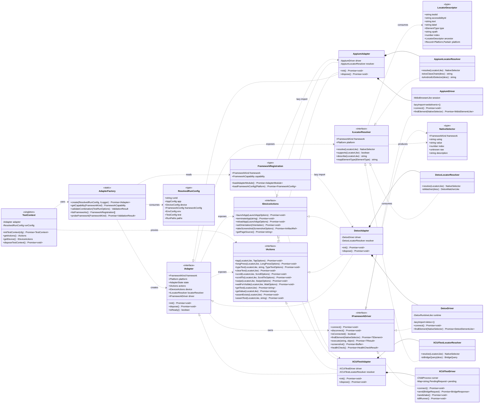
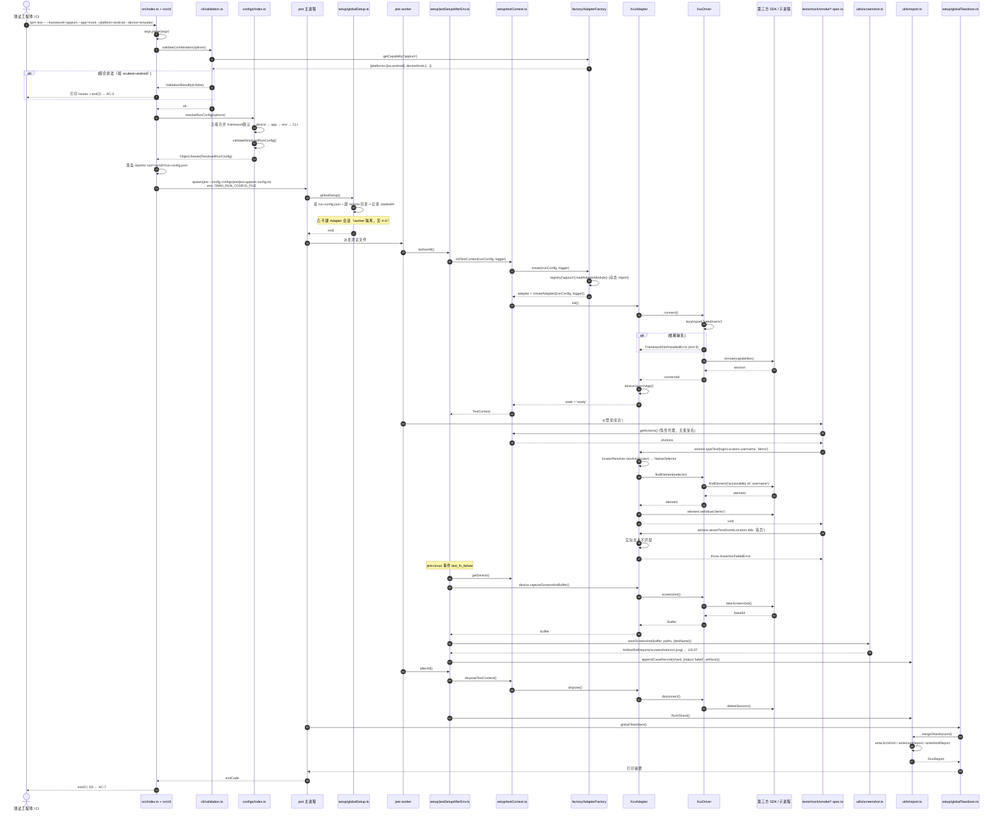
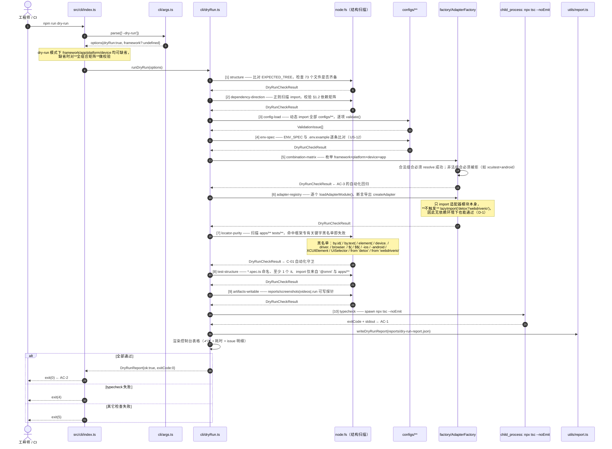
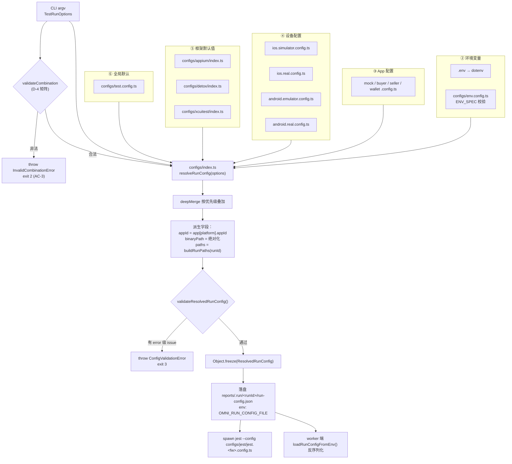
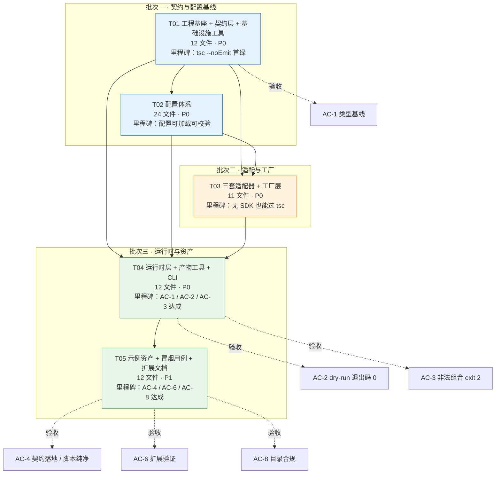

# OmniAutoTest 跨自动化框架统一 E2E 测试工程 — 系统架构设计

> 文档版本：v1.0
> 作者：高见远（Architect）
> 上游输入：`docs/PRD.md`（许清楚 v0.1）+ 交付总监决策 D-1 ~ D-5
> 工程根目录：`/Users/aaronliu/WorkBuddy/OmniAutoTest/e2e/`
> 文档性质：**面向工程实现的落地设计**，接口签名可直接抄写落盘。
> 语言约定：正文简体中文，代码标识符 / 签名英文。

---

## 0. 设计总纲（先读这 8 条）

| 编号 | 决策 | 来源 | 落地方式 |
|------|------|------|----------|
| A-1 | 依赖方向单向指向契约层，**任何模块不得反向依赖上层** | C-05 / 分层原则 | dry-run 内置「依赖方向守卫」静态扫描 |
| A-2 | 第三方框架 SDK **一律惰性动态导入 + 本地结构化类型**，禁止顶层静态 import | D-1 | `utils/lazyImport.ts` + 各适配器目录内自声明最小结构类型 |
| A-3 | 测试脚本通过 **运行时上下文单例 + 惰性代理** 获取能力，脚本内零框架名 | D-2 | `setup/testContext.ts` 暴露 `getActions()/getDevice()` |
| A-4 | CLI 落在 `src/index.ts`（barrel + 入口双职责），逻辑拆到 `src/cli/` 子目录 | D-3 | 顶层目录零增删；参数解析自研，零额外依赖 |
| A-5 | 组合合法性矩阵显式建模，**在 CLI 启动阶段**拒绝非法组合 | D-4 / AC-3 | 矩阵数据挂在 `factory/index.ts` 的 registry 上，新增框架自带能力声明 |
| A-6 | dry-run 是**一等公民**，无设备 / 无 detox / 无 webdriverio 也必须跑绿 | D-5 / C-04 / AC-2 | `src/cli/dryRun.ts` 十项自检 + `reports/dry-run-report.json` |
| A-7 | `FrameworkKind` / `AppKey` 采用**开放字面量联合**（`'a'\|'b'\|(string & {})`） | AC-6 / G2 / G3 | 新增第 4 框架 / 新 App **无需修改 `contracts/`**，直接满足 AC-6 |
| A-8 | 编译目标 **CommonJS + ES2022**，Jest 走 ts-jest；ESM-only 依赖通过 `lazyImport` 真动态导入兜底 | AC-1 / AC-2 | 规避 ts-jest ESM 地狱，同时兼容 webdriverio v9（ESM-only） |

### 0.1 与 PRD / 总监决策的冲突与偏差声明

| 编号 | 冲突点 | 我的建议方案 | 影响 |
|------|--------|--------------|------|
| **X-1** | 总监把 `package.json` / `tsconfig.json` / `.env.example` 排在**批次三**，但批次一的 `contracts/*` + `configs/**` 若无 `tsconfig.json` 就无法做 `tsc --noEmit` 自验，工程师会盲写。 | **前移到批次一的 T01**（与契约层同批交付）。批次三保留 `.gitignore` 与 npm scripts 的补齐。 | 不影响批次划分，只是把「工程基座」并入 T01。**建议采纳。** |
| **X-2** | PRD AC-4 要求「`contracts/` 三文件」，但错误类型、日志接口、配置类型都要放进去。 | 严格保持 **3 个文件**：`types.ts`（含错误类 + `ILogger` + 全部配置类型）、`IElementLocator.ts`、`IActions.ts`。不新增 `errors.ts` / `index.ts`。对外统一从 `src/index.ts` re-export。 | 满足 AC-4 字面要求。 |
| **X-3** | PRD AC-6 要求「核心契约零改动」，但若 `FrameworkKind` 是封闭联合，新增框架必须改 `contracts/types.ts`。 | 采用 A-7 开放联合类型 `BuiltinFrameworkKind \| (string & {})`，保留 IDE 自动补全的同时允许扩展。 | 直接消解 AC-6 的字面矛盾。 |
| **X-4** | Jest `globalSetup` 运行在**主进程**，测试用例运行在 **worker 进程**，主进程创建的 Adapter 单例在 worker 中不可见。PRD/决策未涉及此点。 | `globalSetup` 只做**进程级准备**（解析并冻结运行配置 → 落盘 `reports/.run/<runId>/run-config.json` + 写 `process.env.OMNI_RUN_CONFIG_FILE`）；**Adapter 会话在每个 worker 的 `beforeAll` 中按需创建**（`setup/jestSetupAfterEnv.ts`）。 | 这是本设计最关键的一条工程正确性修正，工程师必须遵守。 |
| **X-5** | Jest 读取 `.ts` 配置文件需要 `ts-node`（`tsx` 不满足 Jest 的 TS config 加载路径）。 | 同时安装 `ts-node`（供 Jest 读 TS config）与 `tsx`（供 CLI 快速执行）。两者均为纯 JS 包。 | 依赖清单已体现。 |
| **X-6** | PRD Q-3 默认「子进程 + xcrun 启动 XCTest Runner」，但 Runner 侧 Swift 工程不在本交付范围。 | 本期交付 **Node 侧完整实现**（进程生命周期、NDJSON 协议编解码、握手/超时/优雅退出）+ **桥接协议规范文档**；Runner 侧 Swift 产物标注为「需 iOS 工程侧配合」，dry-run 只校验 `xcrun` 可执行性与配置完整性，不实际拉起进程。 | 符合 C-03「桥接契约与 dry-run 必须通过」。 |

---

## 1. 总体架构与分层

### 1.1 分层模型

```
┌───────────────────────────────────────────────────────────────┐
│ L7  资产层  apps/**  tests/**                                  │
│     Page Object / Locator / Workflow / spec                    │
│     ⛔ 只允许 import '@omni'（src/index.ts barrel）与 apps 内部  │
├───────────────────────────────────────────────────────────────┤
│ L6  入口层  src/index.ts + src/cli/**                          │
│     barrel export / CLI 解析 / 组合校验 / dry-run / 拉起 jest    │
├───────────────────────────────────────────────────────────────┤
│ L5  运行时层  src/setup/**                                     │
│     globalSetup / globalTeardown / testContext / afterEnv hook │
├───────────────────────────────────────────────────────────────┤
│ L4  工厂层  src/factory/**                                     │
│     registry（框架注册表 + 能力矩阵）/ AdapterFactory            │
├───────────────────────────────────────────────────────────────┤
│ L3  适配层  src/adapters/{appium,xcuitest,detox}/**            │
│     Adapter + Driver + LocatorResolver 三件套                   │
│     ⛔ 禁止依赖 configs / factory / setup / cli                 │
├───────────────────────────────────────────────────────────────┤
│ L2  配置层  src/configs/**                                     │
│     env / test / jest / apps / devices / 各框架 capabilities     │
├───────────────────────────────────────────────────────────────┤
│ L1  基础设施层  src/utils/**                                    │
│     logger / retry / wait / screenshot / report / paths /      │
│     lazyImport   ⛔ 只允许依赖 contracts                        │
├───────────────────────────────────────────────────────────────┤
│ L0  契约层  src/contracts/**  （零运行时依赖）                   │
│     types.ts / IElementLocator.ts / IActions.ts                │
└───────────────────────────────────────────────────────────────┘
```

### 1.2 依赖矩阵（✅ 允许 / ⛔ 禁止）

| 从 ＼ 到 | contracts | utils | configs | adapters | factory | setup | cli |
|---|---|---|---|---|---|---|---|
| **contracts** | — | ⛔ | ⛔ | ⛔ | ⛔ | ⛔ | ⛔ |
| **utils** | ✅ | — | ⛔ | ⛔ | ⛔ | ⛔ | ⛔ |
| **configs** | ✅ | ✅ | — | ⛔ | ⛔ | ⛔ | ⛔ |
| **adapters** | ✅ | ✅ | ⛔ | 同框架内 ✅ / 跨框架 ⛔ | ⛔ | ⛔ | ⛔ |
| **factory** | ✅ | ✅ | ✅(惰性) | ✅(惰性) | — | ⛔ | ⛔ |
| **setup** | ✅ | ✅ | ✅ | ⛔ | ✅ | — | ⛔ |
| **cli / index** | ✅ | ✅ | ✅ | ⛔ | ✅ | ✅ | — |
| **apps / tests** | 仅经 `@omni` | 仅经 `@omni` | ⛔ | ⛔ | ⛔ | 仅经 `@omni` | ⛔ |

> 该矩阵由 dry-run 的 `dependency-direction` 检查项以正则扫描 import 语句自动校验，违规即 exit≠0。

### 1.3 各层职责

- **契约层（L0）**：唯一的「真理源」。定义平台/框架/设备枚举、全部配置类型、声明式 Locator 描述、动作全集接口、适配器生命周期接口、错误类型与退出码。**零运行时依赖**（除 `Error` 内置）。
- **基础设施层（L1）**：与业务无关的横切能力。日志、重试、等待、截图落盘、报告聚合、路径解析、ESM-safe 惰性导入。
- **配置层（L2）**：把「散落的配置文件」解析、校验、按优先级合并为唯一的 `ResolvedRunConfig`。所有配置文件都是**纯数据 + 一个校验函数**，不含控制流。
- **适配层（L3）**：把统一契约翻译成各框架原生调用。三件套职责分离：
  - `*LocatorResolver`：声明式 `LocatorDescriptor` → `NativeSelector`（纯函数，无 I/O，**最易单测**）。
  - `*Driver`：进程 / 会话 / 连接生命周期 + 元素查找 + 原子命令下发（唯一接触第三方 SDK 的地方）。
  - `*Adapter`：实现 `IAdapter`，组合 Driver + Resolver，把 `IActions` / `IDeviceActions` 的语义动作拆成 Driver 的原子命令。
- **工厂层（L4）**：框架注册表（含能力矩阵与配置加载器）+ 按 `ResolvedRunConfig` 惰性实例化 Adapter。**新增框架的唯一改动点**。
- **运行时层（L5）**：Jest 生命周期钩子 + 测试上下文单例 + 失败截图拦截 + 分片报告写入。
- **入口层（L6）**：CLI 参数解析、组合合法性校验、dry-run 自检、拼装并 spawn jest、汇总退出码。
- **资产层（L7）**：业务侧产物。Locator 声明、Page Object、Workflow、spec 用例。**框架无感知**。

---

## 2. 完整文件清单

> 共 **74** 个文件（其中 3 个 Mermaid/架构文档由架构师产出，**工程师需实现 71 个**）。不含已存在的 `docs/PRD.md` 与两个 `.gitkeep`。所有路径相对于 `e2e/`。
> 标记：🆕 新建　✅ 已存在　⭕ 本期占位（内容最小可用）

### 2.1 工程基座（4）

| 路径 | 职责 |
|------|------|
| 🆕 `package.json` | 依赖声明（核心必装 / 框架依赖 optional peer）、npm scripts、engines |
| 🆕 `tsconfig.json` | 唯一编译配置：ES2022 + CommonJS + strict + paths 别名 |
| 🆕 `.env.example` | 环境变量样例，与 `configs/env.config.ts` 的 `ENV_SPEC` 逐条对应 |
| 🆕 `.gitignore` | 忽略 `node_modules/`、`reports/.run/`、`reports/*.xml|json|html`、`*.log` |

### 2.2 契约层 `src/contracts/`（3）

| 路径 | 职责 |
|------|------|
| 🆕 `src/contracts/types.ts` | 基础枚举、全部 Config 类型、`TestRunOptions`/`ResolvedRunConfig`、能力矩阵类型、校验/报告/dry-run 类型、`ILogger`、错误类族与 `EXIT_CODES` |
| 🆕 `src/contracts/IElementLocator.ts` | `LocatorDescriptor` 声明式定位器、`ElementType` 语义类型、`NativeSelector`、`ILocatorResolver`、`defineLocator`/`normalizeLocator` 辅助 |
| 🆕 `src/contracts/IActions.ts` | `IActions` 动作全集、`IDeviceActions` 设备能力、`IAdapter` 生命周期、`IFrameworkDriver` 低层驱动、全部 Options 类型 |

### 2.3 基础设施层 `src/utils/`（7）

| 路径 | 职责 |
|------|------|
| 🆕 `src/utils/paths.ts` | 定位工程根、生成 `RunPaths`、确保目录存在、绝对↔相对路径转换 |
| 🆕 `src/utils/lazyImport.ts` | ESM-safe 真动态导入 `lazyImport<T>(pkg)`；缺包时抛 `FrameworkNotInstalledError`；提供 `isPackageAvailable(pkg)` |
| 🆕 `src/utils/logger.ts` | `ILogger` 实现：级别过滤、`child(scope)`、统一标签（framework/app/platform/device/runId）、text/json 双格式 |
| 🆕 `src/utils/wait.ts` | `sleep`、`waitFor(predicate, opts)`、`withTimeout(promise, ms, msg)`、`pollUntil` |
| 🆕 `src/utils/retry.ts` | `retry(fn, {attempts, delayMs, backoff, retryOn, onRetry})`，支持指数退避与错误白名单 |
| 🆕 `src/utils/screenshot.ts` | `saveScreenshot(buffer, paths, meta)` 命名规范化 + 落盘 + 产出 `ArtifactRef`；`safeCapture(device, ...)` 吞异常不影响主流程 |
| 🆕 `src/utils/report.ts` | worker 端写分片 `reports/.run/<runId>/shards/*.json`；主进程 `mergeShards()`；`writeJUnitXml()` / `writeJsonReport()` / `writeHtmlReport()`（自研，零依赖） |

### 2.4 配置层 `src/configs/`（24）

| 路径 | 职责 |
|------|------|
| 🆕 `src/configs/index.ts` | **配置聚合中枢**：`resolveRunConfig(options)` 执行五级合并；`validateResolvedRunConfig()`；`loadAllConfigsForDryRun()` |
| 🆕 `src/configs/env.config.ts` | `ENV_SPEC` 变量规格表（key/required/default/parse/description）、`loadEnvConfig()`、`validateEnv()`；内部调用 dotenv |
| 🆕 `src/configs/test.config.ts` | 测试执行策略默认值：超时、重试、bail、截图/视频开关、报告输出项 |
| 🆕 `src/configs/jest/jest.base.config.ts` | Jest 基础配置：ts-jest transform、`moduleNameMapper`（镜像 tsconfig paths）、globalSetup/Teardown、setupFilesAfterEach |
| 🆕 `src/configs/jest/jest.appium.config.ts` | 继承 base，`displayName: 'appium'`，超时/worker 数覆盖 |
| 🆕 `src/configs/jest/jest.xcuitest.config.ts` | 继承 base，`displayName: 'xcuitest'`，强制 `maxWorkers: 1`（桥接进程独占） |
| 🆕 `src/configs/jest/jest.detox.config.ts` | 继承 base，`displayName: 'detox'`，`maxWorkers: 1`，`testEnvironment: 'node'` |
| 🆕 `src/configs/appium/appium.ios.config.ts` | iOS 侧 W3C capabilities 默认值（`XCUITest` automationName 等） |
| 🆕 `src/configs/appium/appium.android.config.ts` | Android 侧 capabilities 默认值（`UiAutomator2`、`appPackage/appActivity` 注入点） |
| 🆕 `src/configs/appium/index.ts` | `loadFrameworkConfig(platform): Promise<AppiumFrameworkConfig>` + `validate()` |
| 🆕 `src/configs/xcuitest/xcuitest.config.ts` | xcrun 路径、scheme/testPlan/derivedData/resultBundle、桥接端口与超时 |
| 🆕 `src/configs/xcuitest/index.ts` | `loadFrameworkConfig(platform)`（platform≠ios 直接抛 `InvalidCombinationError`）+ `validate()` |
| 🆕 `src/configs/detox/detox.config.ts` | Detox configuration 名、artifacts 根目录、launchArgs、`.detoxrc` 路径 |
| 🆕 `src/configs/detox/index.ts` | `loadFrameworkConfig(platform)` + `validate()` |
| 🆕 `src/configs/apps/mock.config.ts` | 示例 App：bundleId `com.omni.mock`、package `com.omni.mock`、testId 属性约定 |
| ⭕ `src/configs/apps/buyer.config.ts` | buyer 占位配置（PRD Q-5） |
| ⭕ `src/configs/apps/seller.config.ts` | seller 占位配置 |
| ⭕ `src/configs/apps/wallet.config.ts` | wallet 占位配置 |
| 🆕 `src/configs/apps/index.ts` | `APP_REGISTRY` 映射 + `loadAppConfig(key)` + `listAppKeys()` |
| 🆕 `src/configs/devices/ios.simulator.config.ts` | iPhone 15 / iOS 17 模拟器默认参数 |
| 🆕 `src/configs/devices/ios.real.config.ts` | iOS 真机（udid 由 env 注入） |
| 🆕 `src/configs/devices/android.emulator.config.ts` | Pixel_6_API_34 AVD 默认参数 |
| 🆕 `src/configs/devices/android.real.config.ts` | Android 真机（serial 由 env 注入） |
| 🆕 `src/configs/devices/index.ts` | `DEVICE_REGISTRY` + `loadDeviceConfig(platform, kind)` + `listDeviceIds()` |

### 2.5 适配层 `src/adapters/`（9）

| 路径 | 职责 |
|------|------|
| 🆕 `src/adapters/appium/AppiumLocatorResolver.ts` | 声明式 Locator → W3C / `-ios class chain` / `-ios predicate string` / `-android uiautomator` / `~` 选择器（纯函数） |
| 🆕 `src/adapters/appium/AppiumDriver.ts` | `lazyImport('webdriverio')` → `remote(caps)`；会话生命周期、findElement(s)、execute、screenshot；**内含 webdriverio 最小结构化类型声明** |
| 🆕 `src/adapters/appium/AppiumAdapter.ts` | 实现 `IAdapter`/`IActions`/`IDeviceActions`；导出 `createAdapter(init)` |
| 🆕 `src/adapters/detox/DetoxLocatorResolver.ts` | 声明式 Locator → `by.id/by.text/by.label/by.type` + `.atIndex(n)`；xpath 抛 `UnsupportedLocatorError` |
| 🆕 `src/adapters/detox/DetoxDriver.ts` | `lazyImport('detox')` → `detox.init/cleanup`；持有 `device`/`element`/`by`；**内含 detox 最小结构化类型声明** |
| 🆕 `src/adapters/detox/DetoxAdapter.ts` | 实现 `IAdapter` 三件套组合；`waitFor().toBeVisible().withTimeout()` 语义映射；导出 `createAdapter(init)` |
| 🆕 `src/adapters/xcuitest/XCUITestLocatorResolver.ts` | 声明式 Locator → 桥接查询 DSL（JSON 序列化的 `BridgeQuery`） |
| 🆕 `src/adapters/xcuitest/XCUITestDriver.ts` | `child_process.spawn` 拉起 `xcrun xcodebuild test-without-building`；NDJSON over stdio 协议编解码、请求-响应关联、握手/超时/优雅 kill |
| 🆕 `src/adapters/xcuitest/XCUITestAdapter.ts` | 实现 `IAdapter`，把动作翻译成 `BridgeRequest`；导出 `createAdapter(init)` |

### 2.6 工厂层 `src/factory/`（2）

| 路径 | 职责 |
|------|------|
| 🆕 `src/factory/index.ts` | `FRAMEWORK_REGISTRY`：每个框架一条注册（能力矩阵 + adapter 惰性加载器 + 框架配置惰性加载器）；`registerFramework()` 供外部扩展 |
| 🆕 `src/factory/AdapterFactory.ts` | `create(runConfig, logger)` / `getCapability()` / `validateCombination()` / `listFrameworks()` / `probeFramework()`（dry-run 用，只 import 不连接） |

### 2.7 运行时层 `src/setup/`（4）

| 路径 | 职责 |
|------|------|
| 🆕 `src/setup/testContext.ts` | 上下文单例 + 惰性代理：`initTestContext` / `getTestContext` / `getActions` / `getDevice` / `getRunConfig` / `getLogger` / `disposeTestContext` / `isReady` |
| 🆕 `src/setup/globalSetup.ts` | **主进程**：解析 env 中的运行配置 → 校验 → 建目录 → 落盘 `run-config.json` → 记录起始时间（**不建 Adapter 会话**，见 X-4） |
| 🆕 `src/setup/globalTeardown.ts` | **主进程**：合并分片 → 产出 JUnit XML / JSON / HTML 报告 → 打印摘要 → 清理运行时临时目录 |
| 🆕 `src/setup/jestSetupAfterEnv.ts` | **worker 进程**：`beforeAll` 初始化 Adapter 会话；`jest-circus` 事件钩子捕获失败 → 截图；`afterEach` 记录用例结果分片；`afterAll` dispose |

### 2.8 入口层 `src/`（6）

| 路径 | 职责 |
|------|------|
| 🆕 `src/index.ts` | (a) barrel export（契约 + testContext + 常用 utils，供 `@omni` 消费）；(b) `require.main === module` 时进入 CLI |
| 🆕 `src/cli/index.ts` | `main(argv)`：解析 → help/version → 校验 → dry-run 或 run → 统一错误捕获 → `process.exit(code)` |
| 🆕 `src/cli/args.ts` | 自研参数解析：`--framework/--app/--platform/--device/--dry-run/--test/--retries/--bail/--verbose/--log-level/--help/--version` + `printUsage()` |
| 🆕 `src/cli/validation.ts` | 组合合法性校验（D-4 矩阵）：framework×platform、platform×deviceKind、app×platform、framework 依赖可用性（非 dry-run 时） |
| 🆕 `src/cli/dryRun.ts` | 十项自检编排 + `reports/dry-run-report.json` + 控制台表格 + 退出码 |
| 🆕 `src/cli/runTests.ts` | 选定 jest config → 组装 argv → 注入 `OMNI_RUN_CONFIG_FILE` → `spawn` jest → 透传退出码 |

### 2.9 资产层 `apps/mock/`（9）

| 路径 | 职责 |
|------|------|
| 🆕 `apps/mock/locators/login.locators.ts` | 登录页声明式 Locator（`defineLocator`） |
| 🆕 `apps/mock/locators/home.locators.ts` | 首页声明式 Locator |
| 🆕 `apps/mock/locators/index.ts` | Locator barrel |
| 🆕 `apps/mock/pages/BasePage.ts` | Page 基类：持有 `getActions()` 惰性代理、`waitForLoaded()` 抽象、通用 `screenshot(label)` |
| 🆕 `apps/mock/pages/LoginPage.ts` | 登录页 Page Object：`login(user, pwd)` / `assertLoaded()` / `assertErrorShown()` |
| 🆕 `apps/mock/pages/HomePage.ts` | 首页 Page Object：`assertLoaded()` / `openProfile()` / `scrollToFeedItem(n)` |
| 🆕 `apps/mock/pages/index.ts` | Page barrel |
| 🆕 `apps/mock/workflows/loginWorkflow.ts` | 跨页面业务流：`loginAsDefaultUser()` / `logout()` |
| 🆕 `apps/mock/workflows/index.ts` | Workflow barrel |

### 2.10 用例层 `tests/mock/smoke/`（2）

| 路径 | 职责 |
|------|------|
| 🆕 `tests/mock/smoke/login.smoke.spec.ts` | 登录冒烟：成功登录 / 错误密码报错 / 失败自动截图验证 |
| 🆕 `tests/mock/smoke/navigation.smoke.spec.ts` | 导航冒烟：首页加载 / 滚动 / 进入个人页 / 返回 |

### 2.11 文档 `docs/`（5）

| 路径 | 职责 |
|------|------|
| ✅ `docs/PRD.md` | 需求基线（已存在） |
| 🆕 `docs/ARCHITECTURE.md` | 本文档 |
| 🆕 `docs/class-diagram.mermaid` | 类图源文件 |
| 🆕 `docs/sequence-diagram.mermaid` | 时序图源文件 |
| 🆕 `docs/EXTENDING.md` | 新增第 4 框架 step-by-step（R-16，批次三产出） |

### 2.12 产物目录（已存在）

`reports/screenshots/.gitkeep`、`reports/videos/.gitkeep`；运行期自动创建 `reports/.run/<runId>/`（已 gitignore）。

---

## 3. 核心接口契约（完整 TypeScript 签名）

> 以下三节内容即 `src/contracts/` 三个文件的**权威签名**，工程师按此落地，可补充实现细节但**不得修改签名**。

### 3.1 `src/contracts/types.ts`

```ts
/**
 * OmniAutoTest 契约层 —— 基础类型、配置类型、错误类型。
 * 约束：本文件禁止 import 任何工程内其它模块（零依赖，依赖倒置的根）。
 */

/* ═══════════════ 1. 基础枚举 ═══════════════ */

/** 目标平台 */
export type Platform = 'ios' | 'android';

/** 内置框架种类（新增框架无需修改本文件，见 FrameworkKind） */
export type BuiltinFrameworkKind = 'appium' | 'xcuitest' | 'detox';

/**
 * 框架种类。采用开放字面量联合：保留内置值的 IDE 补全，
 * 同时允许注册第 4 个框架而**不修改契约层**（满足 AC-6）。
 */
export type FrameworkKind = BuiltinFrameworkKind | (string & {});

/** 设备形态 */
export type DeviceKind = 'simulator' | 'emulator' | 'real';

/** 内置业务 App */
export type BuiltinAppKey = 'mock' | 'buyer' | 'seller' | 'wallet';

/** App 标识。开放联合，新增 App 无需修改契约层（满足 G3）。 */
export type AppKey = BuiltinAppKey | (string & {});

/** 屏幕方向 */
export type Orientation = 'portrait' | 'landscape';

/** 滑动方向 */
export type SwipeDirection = 'up' | 'down' | 'left' | 'right';

/** 文本匹配模式 */
export type TextMatchMode = 'exact' | 'contains' | 'startsWith' | 'regex';

/** 日志级别 */
export type LogLevel = 'debug' | 'info' | 'warn' | 'error' | 'silent';

/** 适配器生命周期状态机 */
export type AdapterState =
  | 'idle'
  | 'initializing'
  | 'ready'
  | 'disposing'
  | 'disposed'
  | 'error';

/* ═══════════════ 2. App / Device 配置 ═══════════════ */

/** 单平台的 App 二进制与标识信息 */
export interface AppPlatformBinary {
  /** iOS bundleId 或 Android package name */
  readonly appId: string;
  /** 安装包路径（.app / .ipa / .apk），支持相对工程根路径 */
  readonly binaryPath?: string;
  /** Android 启动 Activity，仅 android 有效 */
  readonly launchActivity?: string;
  /** 不同构建产物路径 */
  readonly build?: {
    readonly debug?: string;
    readonly release?: string;
  };
}

/** 业务 App 配置（`configs/apps/*.config.ts` 的产物类型） */
export interface AppConfig {
  readonly key: AppKey;
  readonly displayName: string;
  /** 该 App 支持的平台，CLI 会据此校验 app×platform 组合 */
  readonly supportedPlatforms: readonly Platform[];
  readonly ios?: AppPlatformBinary;
  readonly android?: AppPlatformBinary;
  /** 启动参数，会透传给各框架的 launchApp */
  readonly launchArgs?: Readonly<Record<string, string | number | boolean>>;
  /** 权限预授权（iOS: camera/photos/location…） */
  readonly permissions?: Readonly<Record<string, 'YES' | 'NO' | 'unset'>>;
  /**
   * testId 在各平台的落地属性名。
   * iOS 默认 'accessibilityIdentifier'；Android 默认 'content-desc'。
   * LocatorResolver 依赖此项决定翻译策略。
   */
  readonly testIdAttribute?: {
    readonly ios?: 'accessibilityIdentifier' | 'name' | (string & {});
    readonly android?: 'content-desc' | 'resource-id' | (string & {});
  };
  /** App 级默认动作超时，优先级低于 CLI/env */
  readonly defaultTimeoutMs?: number;
}

/** 设备配置（`configs/devices/*.config.ts` 的产物类型） */
export interface DeviceConfig {
  /** 唯一标识，形如 'ios.simulator' / 'android.real' */
  readonly id: string;
  readonly platform: Platform;
  readonly kind: DeviceKind;
  /** 设备名，如 'iPhone 15' / 'Pixel_6_API_34' */
  readonly deviceName: string;
  readonly platformVersion?: string;
  /** iOS 真机 udid / Android 真机 serial */
  readonly udid?: string;
  /** Android 模拟器 AVD 名 */
  readonly avdName?: string;
  readonly headless?: boolean;
  readonly orientation?: Orientation;
  readonly newCommandTimeoutSec?: number;
  /** 透传给底层框架的额外能力 */
  readonly extraCapabilities?: Readonly<Record<string, unknown>>;
}

/* ═══════════════ 3. 框架配置 ═══════════════ */

/** 所有框架配置的公共部分 */
export interface FrameworkConfigBase {
  readonly framework: FrameworkKind;
  readonly platform: Platform;
  /** 会话建立超时 */
  readonly startupTimeoutMs: number;
  /** 单个原子动作超时 */
  readonly actionTimeoutMs: number;
  /** 显式等待默认超时 */
  readonly waitTimeoutMs: number;
  /** 轮询间隔 */
  readonly waitIntervalMs: number;
}

export interface AppiumFrameworkConfig extends FrameworkConfigBase {
  readonly framework: 'appium';
  /** 形如 http://127.0.0.1:4723 */
  readonly serverUrl: string;
  readonly automationName: 'XCUITest' | 'UiAutomator2' | (string & {});
  /** W3C capabilities（appium: 前缀由 Driver 统一补全） */
  readonly capabilities: Readonly<Record<string, unknown>>;
  readonly connectionRetries: number;
  readonly logLevel: 'trace' | 'debug' | 'info' | 'warn' | 'error' | 'silent';
}

export interface DetoxFrameworkConfig extends FrameworkConfigBase {
  readonly framework: 'detox';
  /** .detoxrc 中的 configuration 名，如 'ios.sim.debug' */
  readonly configurationName: string;
  /** .detoxrc(.js|.json) 路径 */
  readonly detoxConfigPath: string;
  readonly artifactsRootDir: string;
  readonly launchArgs?: Readonly<Record<string, string | number | boolean>>;
  /** 是否跨用例复用同一 App 实例 */
  readonly reuseSession: boolean;
}

/** XCUITest 子进程桥接协议配置（C-03 / D-1） */
export interface XCUITestBridgeConfig {
  /** stdio: NDJSON over child stdout/stdin（默认）；http: Runner 内起 HTTP server */
  readonly mode: 'stdio' | 'http';
  readonly host: string;
  readonly port: number;
  /** Runner 启动握手超时 */
  readonly handshakeTimeoutMs: number;
  /** 单条桥接命令超时 */
  readonly commandTimeoutMs: number;
  /** 优雅退出信号，超时后升级为 SIGKILL */
  readonly killSignal: NodeJS.Signals;
}

export interface XCUITestFrameworkConfig extends FrameworkConfigBase {
  readonly framework: 'xcuitest';
  /** xcrun 可执行路径，默认 '/usr/bin/xcrun' */
  readonly xcrunPath: string;
  readonly projectPath?: string;
  readonly workspacePath?: string;
  readonly scheme: string;
  readonly testPlan?: string;
  /** XCTest Runner target 名 */
  readonly runnerTarget: string;
  readonly derivedDataPath: string;
  readonly resultBundlePath: string;
  readonly bridge: XCUITestBridgeConfig;
}

/** 框架配置联合类型；第 4 框架可退化到 FrameworkConfigBase */
export type FrameworkConfig =
  | AppiumFrameworkConfig
  | DetoxFrameworkConfig
  | XCUITestFrameworkConfig
  | FrameworkConfigBase;

/* ═══════════════ 4. 环境与测试策略配置 ═══════════════ */

/** 单个环境变量的规格声明（供 .env.example 生成与校验复用） */
export interface EnvVarSpec {
  readonly key: string;
  readonly required: boolean;
  readonly defaultValue?: string;
  readonly description: string;
  /** 类型转换与合法性校验，抛错即视为非法 */
  readonly parse?: (raw: string) => unknown;
}

export interface EnvConfig {
  readonly nodeEnv: 'local' | 'ci' | 'staging' | 'prod' | (string & {});
  readonly baseUrl?: string;
  readonly appiumServerUrl: string;
  readonly credentials: {
    readonly username?: string;
    readonly password?: string;
    readonly otpSecret?: string;
  };
  readonly timeouts: {
    readonly defaultMs: number;
    readonly actionMs: number;
    readonly waitMs: number;
    readonly startupMs: number;
  };
  readonly artifactsDir: string;
  readonly logLevel: LogLevel;
  readonly logFormat: 'text' | 'json';
  readonly xcrunPath: string;
  readonly androidSdkRoot?: string;
  readonly deviceUdid?: string;
}

export interface TestConfig {
  readonly testMatch: readonly string[];
  readonly maxWorkers: number | string;
  readonly retries: number;
  readonly bail: number;
  readonly timeouts: {
    readonly testMs: number;
    readonly hookMs: number;
  };
  readonly screenshot: {
    readonly onFailure: boolean;
    readonly onStep: boolean;
    readonly dir: string;
    readonly format: 'png';
  };
  readonly video: {
    readonly enabled: boolean;
    readonly dir: string;
  };
  readonly report: {
    readonly dir: string;
    readonly junit: boolean;
    readonly json: boolean;
    readonly html: boolean;
  };
}

/* ═══════════════ 5. 运行选项与解析结果 ═══════════════ */

/** CLI 解析产物（未合并配置前的用户意图） */
export interface TestRunOptions {
  readonly framework: FrameworkKind;
  readonly app: AppKey;
  readonly platform: Platform;
  readonly device: DeviceKind;
  readonly dryRun: boolean;
  /** 透传给 jest 的 testPathPattern */
  readonly testPathPattern?: string;
  /** 覆盖设备 udid/serial */
  readonly deviceId?: string;
  readonly tags?: readonly string[];
  readonly retries?: number;
  readonly bail?: boolean;
  readonly headless?: boolean;
  readonly verbose?: boolean;
  readonly logLevel?: LogLevel;
  readonly reportDir?: string;
  /** 原样透传给 jest 的额外参数 */
  readonly jestArgs?: readonly string[];
  readonly help?: boolean;
  readonly version?: boolean;
}

/** 运行期路径集合 */
export interface RunPaths {
  readonly projectRoot: string;
  readonly reportsDir: string;
  readonly screenshotsDir: string;
  readonly videosDir: string;
  /** reports/.run/<runId> */
  readonly runtimeDir: string;
  /** reports/.run/<runId>/run-config.json */
  readonly runConfigFile: string;
  /** reports/.run/<runId>/shards */
  readonly shardsDir: string;
}

/**
 * 五级合并后的**唯一运行时真理源**。
 * 由 configs/index.ts#resolveRunConfig 产出，Object.freeze 后传遍全工程。
 */
export interface ResolvedRunConfig {
  readonly runId: string;
  readonly startedAt: string;
  readonly options: TestRunOptions;
  readonly framework: FrameworkKind;
  readonly platform: Platform;
  readonly deviceKind: DeviceKind;
  readonly app: AppConfig;
  readonly device: DeviceConfig;
  readonly frameworkConfig: FrameworkConfig;
  readonly env: EnvConfig;
  readonly test: TestConfig;
  /** 依据 platform 从 app 解析出的 bundleId / package */
  readonly appId: string;
  /** 依据 platform 解析出的安装包绝对路径 */
  readonly binaryPath?: string;
  readonly paths: RunPaths;
}

/* ═══════════════ 6. 校验与能力矩阵 ═══════════════ */

export interface ValidationIssue {
  /** 形如 OMNI_E_CONFIG_MISSING_FIELD */
  readonly code: string;
  /** 出问题的配置路径，如 'app.ios.appId' */
  readonly path: string;
  readonly message: string;
  readonly severity: 'error' | 'warning';
  readonly hint?: string;
}

export interface ValidationResult {
  readonly ok: boolean;
  readonly issues: readonly ValidationIssue[];
}

/** 框架能力声明（D-4 组合矩阵的数据源） */
export interface FrameworkCapability {
  readonly framework: FrameworkKind;
  readonly displayName: string;
  /** 支持的平台，如 xcuitest 只有 ['ios'] */
  readonly platforms: readonly Platform[];
  /** 每个平台支持的设备形态 */
  readonly deviceKinds: Readonly<Partial<Record<Platform, readonly DeviceKind[]>>>;
  /** 运行所需的 npm 包（dry-run 只探测存在性，不加载） */
  readonly requiredPackages: readonly string[];
  readonly supportsVideo: boolean;
  readonly supportsRealDevice: boolean;
  readonly notes?: string;
}

export interface HealthCheckResult {
  readonly ok: boolean;
  readonly framework: FrameworkKind;
  readonly checks: readonly {
    readonly name: string;
    readonly ok: boolean;
    readonly detail?: string;
  }[];
}

/* ═══════════════ 7. 产物与报告 ═══════════════ */

export type ArtifactKind = 'screenshot' | 'video' | 'log' | 'report' | 'pageSource';

export interface ArtifactRef {
  readonly kind: ArtifactKind;
  readonly path: string;
  /** 相对 reports/ 的路径，写进报告里方便迁移 */
  readonly relativePath: string;
  readonly createdAt: string;
  readonly testName?: string;
  readonly label?: string;
  readonly bytes?: number;
}

export type TestCaseStatus = 'passed' | 'failed' | 'skipped' | 'todo';

export interface TestCaseRecord {
  readonly suite: string;
  readonly name: string;
  readonly fullName: string;
  readonly status: TestCaseStatus;
  readonly durationMs: number;
  readonly failureMessages: readonly string[];
  readonly artifacts: readonly ArtifactRef[];
}

export interface RunReport {
  readonly runId: string;
  readonly startedAt: string;
  readonly finishedAt: string;
  readonly durationMs: number;
  readonly options: TestRunOptions;
  readonly summary: {
    readonly total: number;
    readonly passed: number;
    readonly failed: number;
    readonly skipped: number;
  };
  readonly cases: readonly TestCaseRecord[];
  readonly artifacts: readonly ArtifactRef[];
  readonly exitCode: number;
}

/* ═══════════════ 8. Dry-run 自检 ═══════════════ */

export type DryRunCheckId =
  | 'structure'
  | 'dependency-direction'
  | 'config-load'
  | 'combination-matrix'
  | 'adapter-registry'
  | 'locator-purity'
  | 'test-structure'
  | 'artifacts-writable'
  | 'typecheck'
  | 'env-spec';

export interface DryRunCheckResult {
  readonly id: DryRunCheckId;
  readonly title: string;
  readonly ok: boolean;
  readonly durationMs: number;
  readonly issues: readonly ValidationIssue[];
  readonly details?: readonly string[];
}

export interface DryRunReport {
  readonly runId: string;
  readonly generatedAt: string;
  readonly nodeVersion: string;
  readonly platform: string;
  readonly ok: boolean;
  readonly exitCode: number;
  readonly checks: readonly DryRunCheckResult[];
  readonly summary: {
    readonly total: number;
    readonly passed: number;
    readonly failed: number;
    readonly warnings: number;
  };
}

/* ═══════════════ 9. 日志契约 ═══════════════ */

export type LogContext = Readonly<Record<string, string | number | boolean | undefined>>;

export interface ILogger {
  readonly level: LogLevel;
  debug(message: string, context?: LogContext): void;
  info(message: string, context?: LogContext): void;
  warn(message: string, context?: LogContext): void;
  error(message: string, error?: unknown, context?: LogContext): void;
  /** 派生带 scope 的子 logger，继承并合并上下文标签 */
  child(scope: string, context?: LogContext): ILogger;
  setLevel(level: LogLevel): void;
}

/* ═══════════════ 10. 退出码与错误类族 ═══════════════ */

export const EXIT_CODES = {
  SUCCESS: 0,
  GENERIC: 1,
  /** CLI 参数缺失 / 非法组合（AC-3） */
  INVALID_ARGS: 2,
  /** 配置加载或必填项校验失败 */
  CONFIG_INVALID: 3,
  /** tsc --noEmit 失败 */
  TYPECHECK_FAILED: 4,
  /** dry-run 其它检查项失败 */
  DRY_RUN_FAILED: 5,
  /** 框架依赖未安装 */
  FRAMEWORK_MISSING: 6,
  /** 驱动 / 桥接连接失败 */
  DRIVER_FAILED: 7,
  /** 用例执行失败（jest 非零） */
  TESTS_FAILED: 10,
} as const;

export type ExitCode = (typeof EXIT_CODES)[keyof typeof EXIT_CODES];

export const ERROR_CODES = {
  CONFIG_INVALID: 'OMNI_E_CONFIG_INVALID',
  CONFIG_MISSING_FIELD: 'OMNI_E_CONFIG_MISSING_FIELD',
  ENV_MISSING: 'OMNI_E_ENV_MISSING',
  INVALID_COMBINATION: 'OMNI_E_INVALID_COMBINATION',
  FRAMEWORK_NOT_INSTALLED: 'OMNI_E_FRAMEWORK_NOT_INSTALLED',
  FRAMEWORK_NOT_REGISTERED: 'OMNI_E_FRAMEWORK_NOT_REGISTERED',
  ADAPTER_NOT_INITIALIZED: 'OMNI_E_ADAPTER_NOT_INITIALIZED',
  DRIVER_CONNECTION: 'OMNI_E_DRIVER_CONNECTION',
  BRIDGE: 'OMNI_E_BRIDGE',
  UNSUPPORTED_LOCATOR: 'OMNI_E_UNSUPPORTED_LOCATOR',
  ELEMENT_NOT_FOUND: 'OMNI_E_ELEMENT_NOT_FOUND',
  ACTION_TIMEOUT: 'OMNI_E_ACTION_TIMEOUT',
  ASSERTION_FAILED: 'OMNI_E_ASSERTION_FAILED',
  DRY_RUN_FAILED: 'OMNI_E_DRY_RUN_FAILED',
  NOT_IMPLEMENTED: 'OMNI_E_NOT_IMPLEMENTED',
} as const;

export type OmniErrorCode = (typeof ERROR_CODES)[keyof typeof ERROR_CODES];

export interface OmniErrorOptions {
  readonly exitCode?: number;
  readonly cause?: unknown;
  readonly details?: Readonly<Record<string, unknown>>;
  readonly hint?: string;
}

/**
 * 全工程错误基类。
 * 注意：tsconfig 必须 target >= ES2015（本工程 ES2022），否则 instanceof 失效。
 */
export class OmniError extends Error {
  readonly code: OmniErrorCode;
  readonly exitCode: number;
  readonly details?: Readonly<Record<string, unknown>>;
  readonly hint?: string;

  constructor(code: OmniErrorCode, message: string, options?: OmniErrorOptions) {
    super(message, options?.cause !== undefined ? { cause: options.cause } : undefined);
    this.name = new.target.name;
    this.code = code;
    this.exitCode = options?.exitCode ?? EXIT_CODES.GENERIC;
    this.details = options?.details;
    this.hint = options?.hint;
    Object.setPrototypeOf(this, new.target.prototype);
  }

  toJSON(): Record<string, unknown> {
    return {
      name: this.name,
      code: this.code,
      message: this.message,
      exitCode: this.exitCode,
      details: this.details,
      hint: this.hint,
    };
  }
}

/** 配置校验失败，聚合多条 issue */
export class ConfigValidationError extends OmniError {
  readonly issues: readonly ValidationIssue[];
  constructor(issues: readonly ValidationIssue[], message?: string);
}

/** 框架 × 平台 × 设备 × App 组合非法（AC-3，CLI 阶段抛出） */
export class InvalidCombinationError extends OmniError {
  readonly issues: readonly ValidationIssue[];
  constructor(options: Partial<TestRunOptions>, issues: readonly ValidationIssue[]);
}

/** 第三方框架依赖未安装（D-1 惰性导入失败时抛出） */
export class FrameworkNotInstalledError extends OmniError {
  constructor(framework: FrameworkKind, packageName: string, cause?: unknown);
}

/** 未注册的框架 */
export class FrameworkNotRegisteredError extends OmniError {
  constructor(framework: FrameworkKind, available: readonly FrameworkKind[]);
}

/** 在 testContext 初始化前访问 actions/device */
export class AdapterNotInitializedError extends OmniError {
  constructor(accessor: string);
}

/** 驱动 / 会话建立失败 */
export class DriverConnectionError extends OmniError {
  constructor(framework: FrameworkKind, message: string, cause?: unknown);
}

/** XCUITest 桥接层错误（进程退出 / 协议错误 / 命令超时） */
export class BridgeError extends OmniError {
  constructor(message: string, details?: Readonly<Record<string, unknown>>, cause?: unknown);
}

/** 当前框架无法翻译该 Locator（如 Detox 不支持 xpath） */
export class UnsupportedLocatorError extends OmniError {
  constructor(framework: FrameworkKind, locatorDescription: string, reason: string);
}

/** 元素在超时内未找到 */
export class ElementNotFoundError extends OmniError {
  constructor(locatorDescription: string, timeoutMs: number, cause?: unknown);
}

/** 动作超时 */
export class ActionTimeoutError extends OmniError {
  constructor(action: string, timeoutMs: number, locatorDescription?: string);
}

/** 断言失败（由 IActions.assert* 抛出，便于统一截图） */
export class AssertionFailedError extends OmniError {
  constructor(message: string, details?: Readonly<Record<string, unknown>>);
}

/** dry-run 自检不通过 */
export class DryRunFailedError extends OmniError {
  constructor(report: DryRunReport);
}

/** 类型守卫 */
export function isOmniError(error: unknown): error is OmniError;
/** 从任意异常推导退出码 */
export function toExitCode(error: unknown): number;
```

### 3.2 `src/contracts/IElementLocator.ts`

```ts
import type { FrameworkKind, Platform } from './types';

/**
 * 声明式定位器契约（C-01）。
 * 核心原则：Locator 只描述「找什么」，绝不描述「怎么找」。
 * 任何框架专有选择器语法（by.id / -ios predicate / XCUIElementQuery）
 * 只允许出现在 adapters/<fw>/*LocatorResolver.ts 内部。
 */

/** 框架无关的语义元素类型；由各 Resolver 映射为原生类名 */
export type ElementType =
  | 'button'
  | 'text'
  | 'input'
  | 'image'
  | 'switch'
  | 'checkbox'
  | 'slider'
  | 'link'
  | 'scrollView'
  | 'list'
  | 'cell'
  | 'tab'
  | 'alert'
  | 'webView'
  | 'other';

/**
 * 声明式定位器描述。
 * 多字段同时出现时语义为 **AND**（各 Resolver 需能表达组合，
 * 无法表达时抛 UnsupportedLocatorError，不允许静默降级）。
 */
export interface LocatorDescriptor {
  /** 首选策略：跨平台测试标识（iOS accessibilityIdentifier / Android content-desc 或 resource-id） */
  readonly testId?: string;
  /** 无障碍标识（部分 App 与 testId 不同源时使用） */
  readonly accessibilityId?: string;
  /** 可见文本 */
  readonly text?: string;
  /** 无障碍标签（iOS label / Android contentDescription） */
  readonly label?: string;
  /** 语义元素类型 */
  readonly type?: ElementType;
  /** 原生 id（Android resource-id 短名 / iOS name），慎用 */
  readonly id?: string;
  /** 逃生舱：xpath。仅 Appium / XCUITest 支持，Detox 会抛 UnsupportedLocatorError */
  readonly xpath?: string;
  /** 多命中时取第 index 个（0-based） */
  readonly index?: number;
  /** 文本类字段的匹配模式，默认 'exact' */
  readonly match?: TextMatchModeLite;
  /** 祖先约束：本元素必须位于 ancestor 之内 */
  readonly ancestor?: LocatorDescriptor;
  /** 后代约束：本元素必须包含 descendant */
  readonly descendant?: LocatorDescriptor;
  /** 平台差异覆盖；解析时按当前 platform 深度合并覆盖本对象同名字段 */
  readonly platform?: Readonly<Partial<Record<Platform, Omit<LocatorDescriptor, 'platform'>>>>;
  /** 人类可读描述，用于日志、报错与截图命名 */
  readonly description?: string;
}

/** 与 types.ts 的 TextMatchMode 保持一致，此处独立声明避免循环引用歧义 */
export type TextMatchModeLite = 'exact' | 'contains' | 'startsWith' | 'regex';

/** 字符串简写等价于 `{ testId: value }`，提升脚本可读性 */
export type LocatorLike = LocatorDescriptor | string;

/**
 * Resolver 的输出：框架原生选择器的统一封装。
 * - using/value 供「字符串型选择器」框架（Appium）使用；
 * - raw 供「对象型 matcher」框架（Detox）使用；
 * - query 供「自定义桥接 DSL」框架（XCUITest）使用。
 */
export interface NativeSelector {
  readonly framework: FrameworkKind;
  readonly platform: Platform;
  /** 选择器策略名，如 'accessibility id' | '-ios class chain' | 'xpath' | 'detox-matcher' | 'bridge-query' */
  readonly using: string;
  /** 序列化后的选择器字符串（对象型框架填人类可读摘要） */
  readonly value: string;
  /** 多命中时的下标 */
  readonly index?: number;
  /** 框架原生对象（Detox matcher / XCUITest BridgeQuery），类型对上层不透明 */
  readonly raw?: unknown;
  /** 日志与报错用的可读描述 */
  readonly description: string;
}

/** 定位器解析器契约。实现必须是**纯函数**（无 I/O、无状态、可直接单测）。 */
export interface ILocatorResolver {
  readonly framework: FrameworkKind;
  readonly platform: Platform;

  /**
   * 将声明式定位器翻译为原生选择器。
   * @throws UnsupportedLocatorError 当前框架无法表达该定位语义时
   */
  resolve(locator: LocatorLike): NativeSelector;

  /** 预检：是否可翻译（dry-run 与条件分支使用，不抛异常） */
  supports(locator: LocatorLike): boolean;

  /** 生成可读描述（日志 / 截图命名 / 报错） */
  describe(locator: LocatorLike): string;

  /** 语义元素类型 → 当前平台原生类名，如 'button' → 'XCUIElementTypeButton' */
  mapElementType(type: ElementType): string;
}

/* ─────────── 契约层提供的纯辅助函数（无框架依赖） ─────────── */

/** 身份函数 + 类型收窄，供资产层声明 Locator 时获得完整补全与 readonly 约束 */
export function defineLocator<const T extends LocatorDescriptor>(locator: T): T;

/** 批量声明一个页面的 Locator 集合 */
export function defineLocators<const T extends Record<string, LocatorDescriptor>>(locators: T): T;

/** 字符串简写归一化为 LocatorDescriptor */
export function normalizeLocator(locator: LocatorLike): LocatorDescriptor;

/** 按平台展开 platform 覆盖字段，返回扁平化后的描述（Resolver 内部第一步必须调用） */
export function flattenForPlatform(
  locator: LocatorLike,
  platform: Platform,
): Omit<LocatorDescriptor, 'platform'>;

/** 生成稳定的可读描述，缺省时由字段自动拼装 */
export function describeLocator(locator: LocatorLike): string;
```

### 3.3 `src/contracts/IActions.ts`

```ts
import type {
  AdapterState,
  ArtifactRef,
  DeviceConfig,
  FrameworkKind,
  HealthCheckResult,
  ILogger,
  Orientation,
  Platform,
  ResolvedRunConfig,
  SwipeDirection,
  TextMatchMode,
} from './types';
import type { ILocatorResolver, LocatorLike, NativeSelector } from './IElementLocator';

/**
 * 统一动作契约（C-02）。全部方法为 async。
 * 脚本作者只通过本接口与设备交互，不感知底层框架。
 */

/* ═══════════════ Options ═══════════════ */

export interface BaseActionOptions {
  /** 覆盖框架默认动作超时 */
  readonly timeoutMs?: number;
  /** 多命中时的下标，等价于 Locator.index，优先级更高 */
  readonly index?: number;
  /** 执行前是否等待元素可见，默认 true */
  readonly waitForVisible?: boolean;
}

export interface TapOptions extends BaseActionOptions {
  /** 相对元素左上角的偏移点击 */
  readonly offset?: { readonly x: number; readonly y: number };
}

export interface LongPressOptions extends BaseActionOptions {
  /** 按压时长，默认 1000 */
  readonly durationMs?: number;
}

export interface TypeTextOptions extends BaseActionOptions {
  /** 输入前先清空，默认 true */
  readonly clearFirst?: boolean;
  /** 输入后触发回车/提交 */
  readonly submit?: boolean;
  /** 输入后收起键盘，默认 true */
  readonly hideKeyboardAfter?: boolean;
  /** 逐字输入间隔（部分框架需要），默认 0 */
  readonly typeDelayMs?: number;
}

export interface WaitOptions {
  readonly timeoutMs?: number;
  readonly intervalMs?: number;
  /** 超时报错时附加的业务语义说明 */
  readonly message?: string;
}

export interface ScrollOptions extends BaseActionOptions {
  readonly direction?: SwipeDirection;
  /** 单次滚动距离（像素），未传则按容器高度的 percent 计算 */
  readonly distance?: number;
  /** 单次滚动占容器比例，0~1，默认 0.75 */
  readonly percent?: number;
  /** 最大滚动次数，默认 10 */
  readonly maxSwipes?: number;
}

export interface ScrollToOptions extends ScrollOptions {
  /** 滚动过程中每次检查该元素是否可见 */
  readonly target: LocatorLike;
}

export interface SwipeOptions extends BaseActionOptions {
  readonly direction: SwipeDirection;
  /** 滑动幅度占参考区域比例，0~1，默认 0.6 */
  readonly percent?: number;
  /** 滑动时长，默认 300 */
  readonly durationMs?: number;
}

export interface AssertTextOptions extends BaseActionOptions {
  readonly match?: TextMatchMode;
  readonly ignoreCase?: boolean;
  /** 自定义失败信息 */
  readonly message?: string;
}

export interface LaunchAppOptions {
  /** 是否强制新实例（先 terminate 再 launch），默认 true */
  readonly newInstance?: boolean;
  readonly launchArgs?: Readonly<Record<string, string | number | boolean>>;
  readonly permissions?: Readonly<Record<string, string>>;
  /** 通过 deep link 启动 */
  readonly url?: string;
  /** 启动前删除并重装（Detox 支持） */
  readonly reinstall?: boolean;
  readonly timeoutMs?: number;
}

export interface ScreenshotOptions {
  /** 文件名主体，缺省用当前用例名 */
  readonly name?: string;
  /** 附加标签，写进 ArtifactRef.label */
  readonly label?: string;
}

export interface DeviceInfo {
  readonly platform: Platform;
  readonly platformVersion: string;
  readonly deviceName: string;
  readonly udid?: string;
  readonly screen: {
    readonly width: number;
    readonly height: number;
    readonly scale?: number;
  };
}

/* ═══════════════ IActions：元素级动作全集 ═══════════════ */

export interface IActions {
  /* ── 交互 ── */
  /** 点击元素 */
  tap(locator: LocatorLike, options?: TapOptions): Promise<void>;
  /** 双击 */
  doubleTap(locator: LocatorLike, options?: TapOptions): Promise<void>;
  /** 长按 */
  longPress(locator: LocatorLike, options?: LongPressOptions): Promise<void>;
  /** 按坐标点击（逃生舱，脚本层慎用） */
  tapAt(x: number, y: number, options?: BaseActionOptions): Promise<void>;

  /* ── 输入 ── */
  /** 输入文本 */
  typeText(locator: LocatorLike, text: string, options?: TypeTextOptions): Promise<void>;
  /** 清空输入框 */
  clearText(locator: LocatorLike, options?: BaseActionOptions): Promise<void>;
  /** 替换文本（clear + type 的原子封装） */
  replaceText(locator: LocatorLike, text: string, options?: TypeTextOptions): Promise<void>;
  /** 收起键盘 */
  dismissKeyboard(): Promise<void>;

  /* ── 滚动 / 滑动 ── */
  /** 在容器内滚动固定距离 */
  scroll(container: LocatorLike, options?: ScrollOptions): Promise<void>;
  /** 在容器内滚动直到 target 可见（找不到则抛 ElementNotFoundError） */
  scrollTo(container: LocatorLike, options: ScrollToOptions): Promise<void>;
  /** 在元素上滑动；container 传 null 表示全屏滑动 */
  swipe(target: LocatorLike | null, options: SwipeOptions): Promise<void>;
  /** 下拉刷新语义封装 */
  pullToRefresh(container: LocatorLike, options?: BaseActionOptions): Promise<void>;

  /* ── 等待 ── */
  /** 等待元素可见 */
  waitForVisible(locator: LocatorLike, options?: WaitOptions): Promise<void>;
  /** 等待元素不可见 */
  waitForNotVisible(locator: LocatorLike, options?: WaitOptions): Promise<void>;
  /** 等待元素存在于视图树（不要求可见） */
  waitForExist(locator: LocatorLike, options?: WaitOptions): Promise<void>;
  /** 等待元素从视图树消失 */
  waitForGone(locator: LocatorLike, options?: WaitOptions): Promise<void>;
  /** 等待元素文本满足期望 */
  waitForText(locator: LocatorLike, expected: string, options?: AssertTextOptions & WaitOptions): Promise<void>;
  /** 通用条件等待（业务自定义谓词） */
  waitUntil(predicate: () => Promise<boolean>, options?: WaitOptions): Promise<void>;

  /* ── 查询 ── */
  /** 读取元素文本；元素不存在时抛 ElementNotFoundError */
  getText(locator: LocatorLike, options?: BaseActionOptions): Promise<string>;
  /** 读取元素值（输入框/开关/滑块） */
  getValue(locator: LocatorLike, options?: BaseActionOptions): Promise<string | null>;
  /** 读取任意原生属性 */
  getAttribute(locator: LocatorLike, name: string, options?: BaseActionOptions): Promise<string | null>;
  /** 元素是否存在于视图树（不抛异常） */
  exists(locator: LocatorLike, options?: BaseActionOptions): Promise<boolean>;
  /** 元素是否可见（不抛异常） */
  isVisible(locator: LocatorLike, options?: BaseActionOptions): Promise<boolean>;
  /** 元素是否可用 */
  isEnabled(locator: LocatorLike, options?: BaseActionOptions): Promise<boolean>;
  /** 元素是否选中（switch/checkbox/tab） */
  isSelected(locator: LocatorLike, options?: BaseActionOptions): Promise<boolean>;
  /** 命中元素数量 */
  count(locator: LocatorLike, options?: BaseActionOptions): Promise<number>;

  /* ── 断言（失败统一抛 AssertionFailedError，便于集中截图） ── */
  assertExists(locator: LocatorLike, options?: AssertTextOptions): Promise<void>;
  assertNotExists(locator: LocatorLike, options?: AssertTextOptions): Promise<void>;
  assertVisible(locator: LocatorLike, options?: AssertTextOptions): Promise<void>;
  assertNotVisible(locator: LocatorLike, options?: AssertTextOptions): Promise<void>;
  assertText(locator: LocatorLike, expected: string, options?: AssertTextOptions): Promise<void>;
  assertValue(locator: LocatorLike, expected: string, options?: AssertTextOptions): Promise<void>;
  assertEnabled(locator: LocatorLike, options?: AssertTextOptions): Promise<void>;
  assertCount(locator: LocatorLike, expected: number, options?: AssertTextOptions): Promise<void>;

  /* ── 低层逃生舱（脚本层禁止调用，仅供 Page 基类与调试） ── */
  /** 返回解析后的原生选择器，用于日志与排障 */
  resolveSelector(locator: LocatorLike): NativeSelector;
}

/* ═══════════════ IDeviceActions：设备与 App 级能力 ═══════════════ */

export interface IDeviceActions {
  /* ── App 生命周期 ── */
  launchApp(options?: LaunchAppOptions): Promise<void>;
  terminateApp(appId?: string): Promise<void>;
  /** 重启 App 并复位到初始页面 */
  reloadApp(options?: LaunchAppOptions): Promise<void>;
  installApp(binaryPath?: string): Promise<void>;
  uninstallApp(appId?: string): Promise<void>;
  /** 将 App 切到后台 seconds 秒后回前台 */
  sendToBackground(seconds: number): Promise<void>;
  /** 通过 deep link 打开 */
  openUrl(url: string): Promise<void>;

  /* ── 设备状态 ── */
  setOrientation(orientation: Orientation): Promise<void>;
  getOrientation(): Promise<Orientation>;
  /** 硬件返回键（Android 有效，iOS 抛 OmniError(NOT_IMPLEMENTED)） */
  pressBack(): Promise<void>;
  pressHome(): Promise<void>;
  setPermissions(permissions: Readonly<Record<string, string>>): Promise<void>;
  getDeviceInfo(): Promise<DeviceInfo>;

  /* ── 产物采集 ── */
  /** 低层：返回截图二进制，不落盘 */
  captureScreenshotBuffer(): Promise<Buffer>;
  /** 高层：落盘并登记为 ArtifactRef（内部委托 utils/screenshot） */
  takeScreenshot(options?: ScreenshotOptions): Promise<ArtifactRef>;
  /** 视频录制（R-15 / P2；不支持的框架返回 null） */
  startVideoRecording(options?: ScreenshotOptions): Promise<void>;
  stopVideoRecording(): Promise<ArtifactRef | null>;
  /** 导出当前视图树，排障与 dry-run 快照用 */
  getPageSource(): Promise<string>;
}

/* ═══════════════ IFrameworkDriver：低层驱动契约 ═══════════════ */

/**
 * 唯一允许接触第三方 SDK / 子进程的层。
 * @typeParam TSession 框架会话对象（webdriverio Browser / detox 运行时 / 桥接客户端）
 * @typeParam TElement 框架元素句柄
 */
export interface IFrameworkDriver<TSession = unknown, TElement = unknown> {
  readonly framework: FrameworkKind;
  readonly platform: Platform;

  /** 建立会话 / 拉起子进程；失败抛 DriverConnectionError 或 FrameworkNotInstalledError */
  connect(): Promise<void>;
  /** 断开并释放资源，必须幂等 */
  disconnect(): Promise<void>;
  isConnected(): boolean;
  /** 未连接时抛 AdapterNotInitializedError */
  getSession(): TSession;

  /** 查找单个元素；超时抛 ElementNotFoundError */
  findElement(selector: NativeSelector, timeoutMs?: number): Promise<TElement>;
  /** 查找全部匹配元素，无命中返回空数组 */
  findElements(selector: NativeSelector): Promise<TElement[]>;

  /** 下发原子命令（各框架自定义 command 命名空间） */
  execute<TResult = unknown>(
    command: string,
    args?: Readonly<Record<string, unknown>>,
  ): Promise<TResult>;

  /** 截图二进制 */
  screenshot(): Promise<Buffer>;

  /** 连通性自检，不改变会话状态 */
  healthCheck(): Promise<HealthCheckResult>;
}

/* ═══════════════ IAdapter：框架适配器契约 ═══════════════ */

/** 工厂注入给适配器的构造依赖 */
export interface AdapterInit {
  readonly runConfig: ResolvedRunConfig;
  readonly logger: ILogger;
}

export interface IAdapter {
  readonly framework: FrameworkKind;
  readonly platform: Platform;
  readonly deviceConfig: DeviceConfig;
  readonly state: AdapterState;

  /** 元素级动作 */
  readonly actions: IActions;
  /** 设备与 App 级能力 */
  readonly device: IDeviceActions;
  /** 定位器翻译器 */
  readonly locatorResolver: ILocatorResolver;
  /** 低层驱动（仅供调试与扩展，脚本层禁止访问） */
  readonly driver: IFrameworkDriver;

  /** 建立会话并启动 App；必须幂等（重复调用直接返回） */
  init(): Promise<void>;
  /** 释放全部资源；必须幂等且不抛异常（内部吞错并记日志） */
  dispose(): Promise<void>;
  isReady(): boolean;
  healthCheck(): Promise<HealthCheckResult>;
}

/**
 * 每个适配器模块（`adapters/<fw>/<Fw>Adapter.ts`）必须导出的工厂函数。
 * 工厂层通过惰性 import 拿到它 —— 这是新增框架的唯一契约要求。
 */
export type CreateAdapterFn = (init: AdapterInit) => IAdapter;

/** 适配器模块的结构约束，供 registry 的动态 import 做类型标注 */
export interface AdapterModule {
  readonly createAdapter: CreateAdapterFn;
}
```

---

## 4. 类图（Mermaid classDiagram）

> 源文件：`docs/class-diagram.mermaid`



---

## 5. 关键时序图（Mermaid sequenceDiagram）

> 源文件：`docs/sequence-diagram.mermaid`

### 5.1 正常执行流（CLI → 组合校验 → jest → Adapter → 用例 → 失败截图 → 报告）



### 5.2 Dry-run 自检流（无设备 / 无 detox / 无 webdriverio）



---

## 6. 配置解析链

### 6.1 合并优先级（高 → 低）

```
① CLI 参数（--framework / --app / --platform / --device / --retries / --log-level …）
      ↓ 覆盖
② 环境变量（.env → process.env，经 ENV_SPEC 解析校验）
      ↓ 覆盖
③ App 配置（configs/apps/<app>.config.ts：appId、binaryPath、launchArgs、testIdAttribute、defaultTimeoutMs）
      ↓ 覆盖
④ 设备配置（configs/devices/<platform>.<kind>.config.ts：deviceName、platformVersion、udid、extraCapabilities）
      ↓ 覆盖
⑤ 框架默认值（configs/<framework>/index.ts#loadFrameworkConfig(platform)）
      ↓ 兜底
⑥ 测试策略默认值（configs/test.config.ts：超时、重试、截图/报告开关）
```

> 记忆口诀：**「越靠近人的越优先」** —— 命令行 > 环境 > 业务 > 设备 > 框架 > 全局默认。

### 6.2 解析流程图



### 6.3 关键实现要点

- `resolveRunConfig` 是**纯函数式合并**（除读 `.env` 与文件系统探测 binaryPath 外），便于 dry-run 批量枚举组合。
- 合并采用 `deepMerge`：对象递归、数组整体替换、`undefined` 不覆盖。
- `capabilities` 的最终拼装顺序：`frameworkConfig.capabilities` ← `device.extraCapabilities` ← `app.launchArgs` 派生项 ← CLI `--deviceId`。
- `runId` 生成规则：`<yyyyMMdd-HHmmss>-<framework>-<platform>-<6位随机>`，同时用于报告目录与截图前缀。
- 跨进程传递：**只传 `OMNI_RUN_CONFIG_FILE` 路径**（一个字符串），不塞整个 JSON 到环境变量（避免长度上限与转义问题）。

---

## 7. 扩展指引：新增第 4 个框架（AC-6 / G2）

以新增 `maestro` 为例，**改动面 4 个新文件 + 1 处注册**，`contracts/` 与 `tests/` 与 `apps/` **零改动**。

| 步骤 | 文件 | 说明 | 预估 |
|------|------|------|------|
| 1 | 🆕 `src/adapters/maestro/MaestroLocatorResolver.ts` | 实现 `ILocatorResolver`，纯函数，最易写最易测 | 0.3 人日 |
| 2 | 🆕 `src/adapters/maestro/MaestroDriver.ts` | 实现 `IFrameworkDriver`，`lazyImport` 或子进程，内含最小结构化类型 | 1.0 人日 |
| 3 | 🆕 `src/adapters/maestro/MaestroAdapter.ts` | 实现 `IAdapter`/`IActions`/`IDeviceActions`，导出 `createAdapter` | 1.0 人日 |
| 4 | 🆕 `src/configs/maestro/{maestro.config.ts,index.ts}` | 框架默认配置 + `loadFrameworkConfig(platform)` | 0.2 人日 |
| 5 | ✏️ `src/factory/index.ts` | `FRAMEWORK_REGISTRY` 追加一条注册（能力矩阵 + 两个惰性加载器） | 0.1 人日 |
| 6 | 🆕 `src/configs/jest/jest.maestro.config.ts` | 可选；不加则复用 base | 0.1 人日 |
| 7 | ✅ 验证 | `npm run dry-run` 自动覆盖新框架的组合矩阵与 registry 探测 | 0.3 人日 |
| | | **合计** | **≈ 3.0 人日** ✅ |

**注册代码形态（`src/factory/index.ts`）：**

```ts
registerFramework({
  framework: 'maestro',
  capability: {
    framework: 'maestro',
    displayName: 'Maestro',
    platforms: ['ios', 'android'],
    deviceKinds: { ios: ['simulator', 'real'], android: ['emulator', 'real'] },
    requiredPackages: ['maestro-cli'],
    supportsVideo: true,
    supportsRealDevice: true,
  },
  loadAdapterModule: () => import('../adapters/maestro/MaestroAdapter'),
  loadFrameworkConfig: (platform) =>
    import('../configs/maestro').then((m) => m.loadFrameworkConfig(platform)),
});
```

**为什么不用改 `contracts/`**：`FrameworkKind = BuiltinFrameworkKind | (string & {})`（A-7），`'maestro'` 天然合法。

**为什么不用改 `tests/` 与 `apps/`**：脚本只依赖 `@omni` 的 `getActions()/getDevice()` 与声明式 Locator（A-3 + C-01），与框架完全解耦。dry-run 的 `locator-purity` 检查会持续守护这条边界。

---

## 8. 依赖清单

### 8.1 核心依赖（必装，纯 JS，任何机器 `npm install` 都能成功）

| 包 | 版本范围 | 位置 | 用途 |
|----|----------|------|------|
| `dotenv` | `^16.4.5` | dependencies | 加载 `.env` |
| `typescript` | `^5.6.3` | devDependencies | 编译与 `tsc --noEmit`（AC-1） |
| `jest` | `^29.7.0` | devDependencies | 测试运行器（PRD Q-1） |
| `ts-jest` | `^29.2.5` | devDependencies | TS transform |
| `jest-environment-node` | `^29.7.0` | devDependencies | 显式声明，避免隐式解析失败 |
| `@types/jest` | `^29.5.14` | devDependencies | jest 全局类型 |
| `@types/node` | `^22.7.5` | devDependencies | Node 22 类型 |
| `ts-node` | `^10.9.2` | devDependencies | **Jest 读取 `.ts` 配置文件必需**（X-5） |
| `tsx` | `^4.19.1` | devDependencies | CLI 执行 `src/index.ts`（比 ts-node 快） |

> ⚠ **不引入** commander / yargs / minimist（D-3：参数解析自研）；
> **不引入** jest-junit / allure（报告自研，`utils/report.ts` 手写 XML/HTML）。

### 8.2 可选框架依赖（**不参与 `npm install` 自动安装**）

采用 `peerDependencies` + `peerDependenciesMeta.optional: true`：npm 7+ 对 **optional peer** 不会自动安装，从根本上保证本机 `npm install` 不会去拉 detox / webdriverio。

```jsonc
{
  "peerDependencies": {
    "webdriverio": "^9.0.0 || ^8.0.0",
    "detox": "^20.20.0"
  },
  "peerDependenciesMeta": {
    "webdriverio": { "optional": true },
    "detox":       { "optional": true }
  }
}
```

| 框架 | 需要的包 / 工具 | 安装时机 | 缺失时行为 |
|------|----------------|----------|-----------|
| Appium | `webdriverio` + 独立运行的 Appium Server（`appium@2`，全局安装） | 真机联调前 | `lazyImport` 抛 `FrameworkNotInstalledError`，exit 6；dry-run **不受影响** |
| Detox | `detox` + 原生构建产物 | 真机联调前 | 同上 |
| XCUITest | Xcode CLI（`/usr/bin/xcrun`） | macOS 自带 | dry-run 只做 `fs.existsSync(xcrunPath)` 警告级检查 |

### 8.3 engines

```jsonc
{ "engines": { "node": ">=18.18.0", "npm": ">=9" } }
```

### 8.4 npm scripts

```jsonc
{
  "scripts": {
    "typecheck": "tsc --noEmit",
    "dry-run": "tsx src/index.ts --dry-run",
    "test": "tsx src/index.ts",
    "test:appium:android": "tsx src/index.ts --framework=appium --app=mock --platform=android --device=emulator",
    "test:appium:ios": "tsx src/index.ts --framework=appium --app=mock --platform=ios --device=simulator",
    "test:detox:ios": "tsx src/index.ts --framework=detox --app=mock --platform=ios --device=simulator",
    "test:xcuitest:ios": "tsx src/index.ts --framework=xcuitest --app=mock --platform=ios --device=simulator"
  }
}
```

---

## 9. 跨文件共享约定（工程师必读）

### 9.1 命名规范

| 类别 | 规范 | 示例 |
|------|------|------|
| 类文件 | PascalCase | `AppiumAdapter.ts`、`LoginPage.ts`、`BasePage.ts` |
| 模块 / 工具文件 | camelCase | `lazyImport.ts`、`testContext.ts`、`loginWorkflow.ts` |
| 配置文件 | `<name>.config.ts` | `mock.config.ts`、`ios.simulator.config.ts` |
| 契约文件 | `I<Name>.ts` / `types.ts` | `IActions.ts`、`IElementLocator.ts` |
| Locator 文件 | `<page>.locators.ts` | `login.locators.ts` |
| 用例文件 | `<scope>.<suite>.spec.ts` | `login.smoke.spec.ts` |
| 接口 | `I` 前缀（仅契约层） | `IActions`、`IAdapter` |
| 类型别名 | PascalCase 无前缀 | `ResolvedRunConfig`、`LocatorDescriptor` |
| 常量 | UPPER_SNAKE | `ERROR_CODES`、`EXIT_CODES`、`FRAMEWORK_REGISTRY` |
| 私有成员 | `#field`（原生私有）或 `private readonly` | `#session`、`private readonly logger` |

### 9.2 导出风格

- **一律使用命名导出**，禁止 `export default`。
  - 唯一例外：`src/configs/jest/*.config.ts`（Jest 要求 default export）。
- 每个适配器目录的 `<Fw>Adapter.ts` 必须同时导出：`class <Fw>Adapter` 与 `function createAdapter(init: AdapterInit): IAdapter`。
- 资产层每个子目录提供 `index.ts` barrel；`src/` 下**只有** `src/index.ts` 一个 barrel（避免循环引用）。
- 类型导入统一用 `import type { ... }`（`verbatimModuleSyntax` 友好，且防止运行时误引入）。

### 9.3 路径别名（`tsconfig.json` paths，Jest 需镜像到 `moduleNameMapper`）

```jsonc
{
  "compilerOptions": {
    "target": "ES2022",
    "module": "CommonJS",
    "moduleResolution": "node",
    "lib": ["ES2022"],
    "strict": true,
    "esModuleInterop": true,
    "resolveJsonModule": true,
    "skipLibCheck": true,
    "forceConsistentCasingInFileNames": true,
    "declaration": false,
    "sourceMap": true,
    "noEmit": true,
    "noUncheckedIndexedAccess": false,
    "exactOptionalPropertyTypes": false,
    "types": ["node", "jest"],
    "baseUrl": ".",
    "paths": {
      "@omni":            ["src/index.ts"],
      "@contracts/*":     ["src/contracts/*"],
      "@utils/*":         ["src/utils/*"],
      "@configs/*":       ["src/configs/*"],
      "@adapters/*":      ["src/adapters/*"],
      "@factory/*":       ["src/factory/*"],
      "@setup/*":         ["src/setup/*"],
      "@apps/*":          ["apps/*"]
    }
  },
  "include": ["src/**/*.ts", "apps/**/*.ts", "tests/**/*.ts"],
  "exclude": ["node_modules", "reports"]
}
```

`configs/jest/jest.base.config.ts` 中必须写：

```ts
moduleNameMapper: {
  '^@omni$':         '<rootDir>/src/index.ts',
  '^@contracts/(.*)$': '<rootDir>/src/contracts/$1',
  '^@utils/(.*)$':     '<rootDir>/src/utils/$1',
  '^@configs/(.*)$':   '<rootDir>/src/configs/$1',
  '^@adapters/(.*)$':  '<rootDir>/src/adapters/$1',
  '^@factory/(.*)$':   '<rootDir>/src/factory/$1',
  '^@setup/(.*)$':     '<rootDir>/src/setup/$1',
  '^@apps/(.*)$':      '<rootDir>/apps/$1',
}
```

> ⚠ **资产层唯一允许的 src 入口是 `@omni`**。`tests/**` 与 `apps/**` 中出现 `@adapters/`、`@configs/`、`@factory/` 一律视为违规，dry-run 的 `dependency-direction` 会拦截。

### 9.4 错误处理约定

1. **只抛 `OmniError` 子类**，禁止 `throw new Error(...)` 与 `throw 'string'`。
2. 每个错误必须带 `code`（`ERROR_CODES` 之一）与合适的 `exitCode`。
3. 捕获第三方异常后统一包装：`throw new DriverConnectionError('appium', msg, { cause: err })`。
4. `dispose()` / `disconnect()` **绝不抛异常**，内部 try/catch 并 `logger.warn`。
5. CLI 顶层统一 `catch (e) { printError(e); process.exit(toExitCode(e)); }`。
6. 断言失败必须走 `AssertionFailedError`（不用 jest 的 `expect`），保证失败截图逻辑统一命中。

### 9.5 日志格式（US-11）

**text 模式**（默认）：
```
[2025-08-08T15:20:31.482Z] [INFO ] [fw=appium app=mock pf=android dev=emulator run=20250808-152030-appium-android-a1b2c3] [AppiumDriver] session created {"sessionId":"a3f...","durationMs":4213}
```
**json 模式**（`OMNI_LOG_FORMAT=json`，CI 友好）：
```json
{"ts":"2025-08-08T15:20:31.482Z","level":"info","framework":"appium","app":"mock","platform":"android","device":"emulator","runId":"20250808-152030-appium-android-a1b2c3","scope":"AppiumDriver","msg":"session created","ctx":{"sessionId":"a3f...","durationMs":4213}}
```

规则：
- 全局单例 root logger 由 `createLogger(runConfig)` 创建，各模块用 `logger.child('AppiumDriver')` 派生。
- 标签固定五元组：`framework / app / platform / device / runId`，由 child 自动继承，业务代码不重复传。
- **禁止 `console.log`**（dry-run 的 `dependency-direction` 检查顺带扫描该违规）。唯一例外：`cli/dryRun.ts` 与 `cli/index.ts` 的用户界面输出。
- 每个 `IActions` 方法进入时 `debug` 一条 `action=tap locator=<desc>`，异常时 `error` 一条，便于跨框架对齐轨迹。

### 9.6 异步与超时约定

- 所有跨进程 / 跨网络调用必须包 `withTimeout(promise, ms, message)`（`utils/wait.ts`），禁止裸 `await`。
- 超时层级：`options.timeoutMs` > `app.defaultTimeoutMs` > `frameworkConfig.actionTimeoutMs` > `env.timeouts.actionMs`。
- 重试只在 **Driver 层的连接建立** 与 **显式标注的不稳定动作** 上使用，断言层禁止隐式重试（避免掩盖真实缺陷）。

### 9.7 第三方 SDK 的「最小结构化类型」写法（D-1 落地范式）

每个 Driver 文件顶部声明**只描述我们用到的方法形状**的接口，不 import 第三方类型：

```ts
/* ── webdriverio 最小结构化类型（不依赖 @types，缺包也能通过 tsc） ── */
interface WdioElementLike {
  click(): Promise<void>;
  setValue(value: string): Promise<void>;
  clearValue(): Promise<void>;
  getText(): Promise<string>;
  getAttribute(name: string): Promise<string | null>;
  isDisplayed(): Promise<boolean>;
  isEnabled(): Promise<boolean>;
  getLocation(): Promise<{ x: number; y: number }>;
  getSize(): Promise<{ width: number; height: number }>;
}
interface WdioBrowserLike {
  $(selector: string): Promise<WdioElementLike>;
  $$(selector: string): Promise<WdioElementLike[]>;
  execute<T>(script: string, ...args: unknown[]): Promise<T>;
  executeScript<T>(script: string, args: unknown[]): Promise<T>;
  takeScreenshot(): Promise<string>;
  deleteSession(): Promise<void>;
  activateApp(appId: string): Promise<void>;
  terminateApp(appId: string): Promise<void>;
  setOrientation(o: string): Promise<void>;
  getOrientation(): Promise<string>;
  getPageSource(): Promise<string>;
  hideKeyboard?(): Promise<void>;
  back?(): Promise<void>;
}
interface WebdriverIOModuleLike {
  remote(options: Record<string, unknown>): Promise<WdioBrowserLike>;
}

/* ── 使用（惰性，且 try/catch 语义化） ── */
const wdio = await lazyImport<WebdriverIOModuleLike>('webdriverio', 'appium');
this.#session = await wdio.remote(this.#buildRemoteOptions());
```

`utils/lazyImport.ts` 的签名与实现要点：

```ts
/**
 * ESM-safe 真动态导入。
 * 注意：tsconfig module=CommonJS 会把 `import()` 降级为 require，
 * 而 webdriverio v9 是 ESM-only，必须用 Function 构造器绕开降级。
 */
export async function lazyImport<T>(
  packageName: string,
  framework?: FrameworkKind,
): Promise<T>;

/** 只探测存在性，不执行模块（dry-run 用） */
export function isPackageAvailable(packageName: string): boolean;
```

实现要点：
- 内部 `const dynamicImport = new Function('m', 'return import(m)') as (m: string) => Promise<unknown>;`
- 捕获 `ERR_MODULE_NOT_FOUND` / `MODULE_NOT_FOUND` → 抛 `FrameworkNotInstalledError(framework, packageName, cause)`；其它错误原样包装为 `OmniError`。
- 兼容 CJS/ESM 双形态：`return (mod?.default ?? mod) as T`（对既有 default 又有具名导出的包做合并处理）。
- `isPackageAvailable` 用 `require.resolve(packageName)` 包 try/catch，**不执行**模块副作用。

### 9.8 XCUITest 桥接协议规范（C-03 / X-6）

**传输**：NDJSON over child stdio（`mode: 'stdio'`），每行一个 JSON 对象；`mode: 'http'` 为备选。

```ts
interface BridgeRequest {
  readonly id: string;              // uuid，用于请求-响应关联
  readonly command: BridgeCommand;
  readonly params?: Record<string, unknown>;
  readonly timeoutMs?: number;
}
interface BridgeResponse {
  readonly id: string;
  readonly ok: boolean;
  readonly result?: unknown;
  readonly error?: { code: string; message: string; stack?: string };
}
type BridgeCommand =
  | 'session.start' | 'session.end' | 'session.ping'
  | 'app.launch' | 'app.terminate' | 'app.activate' | 'app.openUrl'
  | 'element.find' | 'element.findAll' | 'element.tap' | 'element.doubleTap'
  | 'element.longPress' | 'element.typeText' | 'element.clearText'
  | 'element.getText' | 'element.getValue' | 'element.getAttribute'
  | 'element.exists' | 'element.isVisible' | 'element.isEnabled' | 'element.count'
  | 'element.scroll' | 'element.swipe'
  | 'device.screenshot' | 'device.setOrientation' | 'device.getOrientation'
  | 'device.info' | 'device.pageSource'
  | 'device.startRecording' | 'device.stopRecording';

/** LocatorResolver 产出、序列化进 params 的查询 DSL */
interface BridgeQuery {
  readonly elementType?: string;    // XCUIElementTypeButton 等
  readonly identifier?: string;     // accessibilityIdentifier
  readonly label?: string;
  readonly value?: string;
  readonly text?: string;
  readonly match?: 'exact' | 'contains' | 'startsWith' | 'regex';
  readonly index?: number;
  readonly ancestor?: BridgeQuery;
  readonly descendant?: BridgeQuery;
}
```

**`XCUITestDriver` 生命周期**：
1. `connect()` → `spawn(xcrunPath, ['xcodebuild', 'test-without-building', '-xctestrun', ..., '-destination', `platform=iOS Simulator,name=${deviceName}`], { stdio: ['pipe','pipe','pipe'] })`。
2. 监听 stdout 逐行解析；等待 Runner 发出 `{"event":"ready","port":...}` 完成握手（`handshakeTimeoutMs` 超时抛 `BridgeError`）。
3. `send(request)` 写入 stdin 一行 JSON，在 `#pending: Map<id, {resolve, reject, timer}>` 中挂起，收到同 id 响应后结算；`commandTimeoutMs` 超时 reject `BridgeError`。
4. `disconnect()` → 发送 `session.end` → 等待优雅退出 → 超时后 `kill(killSignal)` → 再超时 `SIGKILL`；进程 `exit`/`error` 事件统一 reject 所有 pending。
5. 监听 `process.on('exit'|'SIGINT'|'SIGTERM')` 注册清理，避免僵尸进程。

**本期交付边界**：Node 侧完整实现 + 协议文档；Runner 侧 Swift 工程由 iOS 团队按本协议实现，未就绪时 `connect()` 抛 `BridgeError` 并给出 `hint`。dry-run 不拉起进程，只校验 `xcrunPath` 存在与配置完整性。

### 9.9 定位器翻译对照表（各 Resolver 的实现依据）

| 声明式字段 | Appium iOS | Appium Android | Detox | XCUITest 桥接 |
|-----------|------------|----------------|-------|---------------|
| `testId` | `~<v>`（accessibility id） | 依 `app.testIdAttribute.android`：`content-desc` → `~<v>`；`resource-id` → `-android uiautomator: new UiSelector().resourceId("<pkg>:id/<v>")` | `by.id('<v>')` | `{identifier:'<v>'}` |
| `accessibilityId` | `~<v>` | `~<v>` | `by.id('<v>')` | `{identifier:'<v>'}` |
| `text` | `-ios predicate string: label == "<v>" OR value == "<v>"`（contains 时用 `CONTAINS`） | `-android uiautomator: new UiSelector().text("<v>")`（contains → `.textContains`） | `by.text('<v>')` | `{text:'<v>', match:...}` |
| `label` | `-ios predicate string: label == "<v>"` | `~<v>` | `by.label('<v>')` | `{label:'<v>'}` |
| `type` | `-ios class chain: **/XCUIElementType<T>` | `-android uiautomator: new UiSelector().className("<androidClass>")` | `by.type('<nativeClass>')` | `{elementType:'XCUIElementType<T>'}` |
| `id` | `~<v>` | `-android uiautomator: ...resourceId(...)` | `by.id('<v>')` | `{identifier:'<v>'}` |
| `xpath` | `xpath` 原样 | `xpath` 原样 | ❌ `UnsupportedLocatorError` | `xpath` 原样（Runner 侧支持有限，警告） |
| `index` | `[<n>]` 追加到 class chain / `findElements()[n]` | 同左 | `.atIndex(<n>)` | `{index:<n>}` |
| `ancestor` | class chain 前缀嵌套 | UiSelector `.fromParent()` | `.withAncestor(matcher)` | `{ancestor:{...}}` |
| `descendant` | class chain 后缀嵌套 | `.childSelector()` | `.withDescendant(matcher)` | `{descendant:{...}}` |
| 多字段并存 | predicate 用 `AND` 连接 | UiSelector 链式 `.` 连接 | `matcher.and(matcher)` | 同对象多字段即 AND |

**`ElementType` → 原生类名映射表**：

| 语义类型 | iOS（XCUIElementType*） | Android |
|---------|------------------------|---------|
| `button` | `XCUIElementTypeButton` | `android.widget.Button` |
| `text` | `XCUIElementTypeStaticText` | `android.widget.TextView` |
| `input` | `XCUIElementTypeTextField` | `android.widget.EditText` |
| `image` | `XCUIElementTypeImage` | `android.widget.ImageView` |
| `switch` | `XCUIElementTypeSwitch` | `android.widget.Switch` |
| `checkbox` | `XCUIElementTypeCheckBox` | `android.widget.CheckBox` |
| `slider` | `XCUIElementTypeSlider` | `android.widget.SeekBar` |
| `link` | `XCUIElementTypeLink` | `android.widget.TextView` |
| `scrollView` | `XCUIElementTypeScrollView` | `android.widget.ScrollView` |
| `list` | `XCUIElementTypeTable` | `androidx.recyclerview.widget.RecyclerView` |
| `cell` | `XCUIElementTypeCell` | `android.view.ViewGroup` |
| `tab` | `XCUIElementTypeTabBar` | `android.widget.TabWidget` |
| `alert` | `XCUIElementTypeAlert` | `android.app.AlertDialog` |
| `webView` | `XCUIElementTypeWebView` | `android.webkit.WebView` |
| `other` | `XCUIElementTypeOther` | `android.view.View` |

### 9.10 测试上下文与惰性代理（D-2 落地范式）

```ts
/* setup/testContext.ts */
export interface TestContext {
  readonly runConfig: ResolvedRunConfig;
  readonly adapter: IAdapter;
  readonly actions: IActions;
  readonly device: IDeviceActions;
  readonly logger: ILogger;
}

/** worker 端 beforeAll 调用；幂等 */
export async function initTestContext(runConfig?: ResolvedRunConfig): Promise<TestContext>;
/** 从 OMNI_RUN_CONFIG_FILE 反序列化运行配置（worker 端使用） */
export function loadRunConfigFromEnv(): ResolvedRunConfig;
/** 未初始化时抛 AdapterNotInitializedError，错误信息给出「是否忘记配置 setupFilesAfterEach」提示 */
export function getTestContext(): TestContext;
export function getRunConfig(): ResolvedRunConfig;
export function getLogger(scope?: string): ILogger;
export function isTestContextReady(): boolean;
export async function disposeTestContext(): Promise<void>;

/**
 * 惰性代理：返回的对象在**调用方法时**才解析真实 adapter，
 * 因此可以在模块顶层 `const actions = getActions()` 安全持有
 * （Page Object 基类正是这么用的）。
 */
export function getActions(): IActions;
export function getDevice(): IDeviceActions;
```

实现要点：`getActions()` 返回 `new Proxy({} as IActions, { get: (_, prop) => (...args) => (getTestContext().actions as any)[prop](...args) })`，并缓存已生成的方法包装以减少开销。未初始化时 `getTestContext()` 抛出的错误信息必须包含：`当前 framework 未初始化，请确认 jest 配置的 setupFilesAfterEach 指向 src/setup/jestSetupAfterEnv.ts，或在非 jest 环境手动调用 initTestContext()`。

**脚本侧的标准写法（框架名零出现）**：

```ts
/* tests/mock/smoke/login.smoke.spec.ts */
import { getActions, getDevice } from '@omni';
import { LoginPage, HomePage } from '@apps/mock/pages';

describe('mock · 登录冒烟', () => {
  const login = new LoginPage();
  const home = new HomePage();

  beforeEach(async () => {
    await getDevice().reloadApp();
  });

  it('使用有效凭据登录成功', async () => {
    await login.assertLoaded();
    await login.login('demo', 'demo123');
    await home.assertLoaded();
  });

  it('密码错误时展示错误提示', async () => {
    await login.login('demo', 'wrong');
    await login.assertErrorShown('账号或密码错误');
  });
});
```

### 9.11 失败截图触发链（US-07，三重保障）

| 层级 | 触发点 | 覆盖范围 | 优先级 |
|------|--------|----------|--------|
| ① Adapter 动作代理 | `AdapterBase` 用 `createFailureCaptureProxy(actions)` 包裹 `IActions`，任意方法抛错时先截图再 rethrow | 覆盖所有经 `IActions` 产生的失败（含全部 `assert*`）——**这是主链路** | 必做 |
| ② jest-circus 事件 | `jestSetupAfterEnv.ts` 中 `addEventHandler(e => e.name === 'test_fn_failure' \|\| e.name === 'hook_failure')` | 覆盖脚本里直接写 `expect()` 或抛裸异常的场景 | 必做 |
| ③ afterEach 兜底 | `afterEach` 中检查本用例是否已产出截图，未产出且状态为失败则补拍 | 兜底 | 建议 |

> `addEventHandler` 从 `'jest-circus'` 导入，必须包 try/catch —— 若运行在 jasmine2 runner 下降级为 ①+③。
> 截图命名规范：`<runId>__<suite>__<testName>__<seq>__<label>.png`，非法字符替换为 `-`，总长截断至 180 字符。

---

## 10. 任务分解

### 10.0 批次划分总览与一处偏差声明

| 批次 | 任务 | 文件数 | 交付里程碑 |
|------|------|--------|-----------|
| **批次一** | T01 工程基座 + 契约层 + 基础设施工具 | 12 | `npx tsc --noEmit` 通过（AC-1 首次达成） |
| **批次一** | T02 配置体系 | 24 | 全部配置可加载、必填校验可跑 |
| **批次二** | T03 三套适配器 + 工厂层 | 11 | 组合矩阵可查、适配器模块可 import（无 SDK 也能过 tsc） |
| **批次三** | T04 运行时层 + 产物工具 + CLI 入口 | 12 | **`npm run dry-run` 退出码 0（AC-2 达成）**、AC-3 达成 |
| **批次三** | T05 示例资产 + 冒烟用例 + 扩展文档 | 12 | AC-4 / AC-6 / AC-8 达成，具备真机联调条件 |
| | **合计** | **71** | |

> **偏差 X-7（需总监知悉）**：总监原定「批次三包含 `utils/*` + `package.json` + `tsconfig.json` + `.env.example`」。
> 但 —— ①批次一没有 `tsconfig.json` 就无法自验 `tsc --noEmit`；②`configs/**`（批次一）需要 `utils/paths.ts`；③`adapters/**`（批次二）需要 `utils/lazyImport.ts` / `logger.ts` / `wait.ts` / `retry.ts`。
> 因此把**工程基座 4 文件 + 5 个纯基础设施 util** 前移到批次一 T01；批次三仍保留 `utils/screenshot.ts` 与 `utils/report.ts`（它们依赖运行时上下文，天然属于批次三）。
> 批次数量与交接节奏不变，**建议采纳**。

---

### T01 ｜工程基座 + 契约层 + 基础设施工具　【批次一 · P0 · 无前置】

**源文件（12）**

```
package.json
tsconfig.json
.env.example
.gitignore
src/contracts/types.ts
src/contracts/IElementLocator.ts
src/contracts/IActions.ts
src/utils/paths.ts
src/utils/lazyImport.ts
src/utils/logger.ts
src/utils/wait.ts
src/utils/retry.ts
```

**依赖前置**：无（工程起点）

**关键实现要点**
1. `tsconfig.json` 严格照抄 §9.3：`target: ES2022`（否则 `OmniError extends Error` 的 `instanceof` 失效）、`module: CommonJS`、`strict: true`、`noEmit: true`、8 条 paths 别名。
2. `package.json`：依赖严格按 §8.1/§8.2 —— 核心依赖只有 9 个纯 JS 包；`webdriverio`/`detox` 放 `peerDependencies` + `peerDependenciesMeta.optional=true`，**绝不放 dependencies/devDependencies**。scripts 照抄 §8.4。
3. `contracts/` 三文件严格照抄 §3.1 / §3.2 / §3.3 的签名，**一字不改**。错误类需补齐构造函数实现（父类 `OmniError` 已给出完整实现）。
4. `contracts/types.ts` 禁止 import 任何工程内模块；`IElementLocator.ts` / `IActions.ts` 只允许 `import type` 自 `./types`。
5. `utils/lazyImport.ts` 必须用 `new Function('m','return import(m)')` 绕开 CommonJS 降级（§9.7），并区分「模块不存在」与「模块加载报错」两类异常。
6. `utils/paths.ts`：`findProjectRoot()` 从 `__dirname` 向上找含 `package.json` 且目录名为 `e2e` 的目录；`buildRunPaths(runId)` 产出 `RunPaths`；`ensureDir()` 递归建目录。
7. `utils/logger.ts`：实现 `ILogger`，支持 text/json 双格式与 `child(scope, ctx)` 标签继承，级别过滤按 `debug<info<warn<error<silent`。
8. `.env.example` 的每一行都要能对应到 T02 的 `ENV_SPEC` 条目（T02 会写反向校验）。

**验收点**
- ✅ `npm install` 在**无网络代理、无 Xcode、无 Android SDK** 的机器上成功，且 `node_modules` 中**不存在** `detox` / `webdriverio`。
- ✅ `npx tsc --noEmit` 通过（此时只有契约与 utils，应当零报错）。
- ✅ `node -e "const{OmniError,ConfigValidationError}=require('...');"` 级别的 smoke：`new ConfigValidationError([]) instanceof OmniError === true`。
- ✅ `contracts/` 恰好 3 个文件（AC-4 前置）。

---

### T02 ｜配置体系　【批次一 · P0 · 依赖 T01】

**源文件（24）**

```
src/configs/index.ts
src/configs/env.config.ts
src/configs/test.config.ts
src/configs/jest/jest.base.config.ts
src/configs/jest/jest.appium.config.ts
src/configs/jest/jest.xcuitest.config.ts
src/configs/jest/jest.detox.config.ts
src/configs/appium/appium.ios.config.ts
src/configs/appium/appium.android.config.ts
src/configs/appium/index.ts
src/configs/xcuitest/xcuitest.config.ts
src/configs/xcuitest/index.ts
src/configs/detox/detox.config.ts
src/configs/detox/index.ts
src/configs/apps/mock.config.ts
src/configs/apps/buyer.config.ts
src/configs/apps/seller.config.ts
src/configs/apps/wallet.config.ts
src/configs/apps/index.ts
src/configs/devices/ios.simulator.config.ts
src/configs/devices/ios.real.config.ts
src/configs/devices/android.emulator.config.ts
src/configs/devices/android.real.config.ts
src/configs/devices/index.ts
```

**依赖前置**：T01

**关键实现要点**
1. `configs/index.ts` 导出四个函数：
   ```ts
   export async function resolveRunConfig(options: TestRunOptions): Promise<ResolvedRunConfig>;
   export function validateResolvedRunConfig(cfg: ResolvedRunConfig): ValidationResult;
   export async function loadAllConfigsForDryRun(): Promise<{ apps: AppConfig[]; devices: DeviceConfig[]; issues: ValidationIssue[] }>;
   export function deepMerge<T>(base: T, ...overrides: Array<Partial<T> | undefined>): T;
   ```
   合并顺序严格按 §6.1 的 ⑥→⑤→④→③→②→①。`undefined` 不覆盖，数组整体替换。
2. 每个配置文件导出**纯数据常量 + 一个 `validate(): ValidationIssue[]`**，禁止在配置文件里写 I/O 或控制流。
3. `env.config.ts`：定义 `ENV_SPEC: readonly EnvVarSpec[]`（每条含 key/required/default/description/parse），`loadEnvConfig()` 调用 `dotenv.config()` 后逐条解析；缺失 required 项聚合成 `ConfigValidationError`（US-12）。
4. `configs/<fw>/index.ts` 统一导出 `loadFrameworkConfig(platform: Platform): Promise<FrameworkConfig>` 与 `validate(cfg): ValidationIssue[]`；`xcuitest/index.ts` 在 `platform !== 'ios'` 时抛 `InvalidCombinationError`（D-4 的第二道防线）。
5. `configs/apps/index.ts` 与 `configs/devices/index.ts` 用**静态 Record 映射**（非 fs 扫描），保证 dry-run 可枚举、tsc 可校验。
6. `jest.base.config.ts`：
   - `rootDir: <e2e 根>`、`roots: ['<rootDir>/tests']`、`testEnvironment: 'node'`
   - `transform: { '^.+\\.tsx?$': ['ts-jest', { tsconfig: '<rootDir>/tsconfig.json', isolatedModules: true }] }`
   - `moduleNameMapper` 照抄 §9.3
   - `globalSetup: '<rootDir>/src/setup/globalSetup.ts'`、`globalTeardown: '<rootDir>/src/setup/globalTeardown.ts'`、`setupFilesAfterEach: ['<rootDir>/src/setup/jestSetupAfterEnv.ts']`
   - `default export`（Jest 要求，本工程唯一的 default export 例外）
   > 注：此时 T04 的 setup 文件尚不存在，jest config 只是**声明路径**，不会在 T02 阶段被执行，不影响 tsc。
7. `jest.xcuitest.config.ts` 与 `jest.detox.config.ts` 必须设 `maxWorkers: 1`（桥接进程 / Detox 会话独占设备）。
8. `mock.config.ts` 是唯一"完整"的 App 配置：`appId` iOS `com.omni.mock`、Android `com.omni.mock`、`testIdAttribute: { ios:'accessibilityIdentifier', android:'content-desc' }`；buyer/seller/wallet 为占位（`supportedPlatforms` 填全、`binaryPath` 留空并在 validate 中产出 `warning` 级 issue，不阻塞 dry-run）。

**验收点**
- ✅ `npx tsc --noEmit` 仍然通过。
- ✅ 临时脚本能执行 `resolveRunConfig({framework:'appium',app:'mock',platform:'android',device:'emulator',dryRun:true})` 并返回冻结对象，`appId === 'com.omni.mock'`。
- ✅ `resolveRunConfig({framework:'xcuitest',platform:'android',...})` 抛 `InvalidCombinationError`。
- ✅ 删除 `.env` 后 `loadEnvConfig()` 仍能靠 default 值工作；把某个 required 变量置空则抛 `ConfigValidationError`。
- ✅ `ENV_SPEC` 的 key 集合 与 `.env.example` 的 key 集合完全一致。

---

### T03 ｜三套适配器 + 工厂层　【批次二 · P0 · 依赖 T01、T02】

**源文件（11）**

```
src/adapters/appium/AppiumLocatorResolver.ts
src/adapters/appium/AppiumDriver.ts
src/adapters/appium/AppiumAdapter.ts
src/adapters/detox/DetoxLocatorResolver.ts
src/adapters/detox/DetoxDriver.ts
src/adapters/detox/DetoxAdapter.ts
src/adapters/xcuitest/XCUITestLocatorResolver.ts
src/adapters/xcuitest/XCUITestDriver.ts
src/adapters/xcuitest/XCUITestAdapter.ts
src/factory/index.ts
src/factory/AdapterFactory.ts
```

**依赖前置**：T01（契约 + lazyImport + logger）、T02（`FrameworkConfig` 各具体类型）

**关键实现要点**
1. **实现顺序建议**：三个 `*LocatorResolver`（纯函数，最快）→ 三个 `*Driver` → 三个 `*Adapter` → `factory/`。
2. **D-1 铁律**：三个 Driver 文件**顶部禁止出现** `import ... from 'webdriverio'|'detox'`。SDK 只能经 `lazyImport<T>(pkg, framework)` 获取，返回类型是本文件内声明的「最小结构化接口」（范式见 §9.7）。
   - `AppiumDriver.ts` 声明 `WdioBrowserLike` / `WdioElementLike` / `WebdriverIOModuleLike`
   - `DetoxDriver.ts` 声明 `DetoxModuleLike`（`init/cleanup/device/element/by/waitFor`）、`DetoxElementLike`、`DetoxMatcherLike`
   - `XCUITestDriver.ts` 无第三方包，只用 `node:child_process` / `node:readline`
3. `*LocatorResolver` 实现第一步必须调用 `flattenForPlatform(locator, this.platform)`，再按 §9.9 对照表翻译。无法表达的组合抛 `UnsupportedLocatorError`（**禁止静默降级为 xpath**）。
4. `*Adapter` 建议提取一个**同目录内**的私有基类或共享函数（如 `AppiumAdapter.ts` 内的 `createActions()`）来实现 `IActions` 的 40+ 方法；`assert*` 系列统一先 `waitForVisible` 再取值比较，失败抛 `AssertionFailedError`（携带 `expected`/`actual`/`locator` 三个 details）。
5. `*Adapter` 必须用 `createFailureCaptureProxy` 包裹对外暴露的 `actions`（§9.11 第①层）；该 proxy 在此任务内以「回调注入」形式实现（`onActionError?: (err, action, locator) => Promise<void>`），T04 再由 testContext 注入真实截图回调 —— **避免 adapters 反向依赖 utils/screenshot**。
6. `XCUITestDriver` 按 §9.8 完整实现 Node 侧：spawn、NDJSON 行解析、`#pending` Map 关联、握手超时、命令超时、优雅 kill 升级 SIGKILL、进程退出统一 reject、`process.on('exit')` 清理钩子。
7. `factory/index.ts`：
   ```ts
   export interface FrameworkRegistration {
     readonly framework: FrameworkKind;
     readonly capability: FrameworkCapability;
     readonly loadAdapterModule: () => Promise<AdapterModule>;
     readonly loadFrameworkConfig: (platform: Platform) => Promise<FrameworkConfig>;
   }
   export function registerFramework(reg: FrameworkRegistration): void;
   export function getRegistration(fw: FrameworkKind): FrameworkRegistration | undefined;
   export function listRegistrations(): readonly FrameworkRegistration[];
   export const FRAMEWORK_REGISTRY: ReadonlyMap<FrameworkKind, FrameworkRegistration>;
   ```
   三条内置注册的能力矩阵（**D-4 的唯一数据源**）：
   | framework | platforms | ios deviceKinds | android deviceKinds | requiredPackages |
   |---|---|---|---|---|
   | appium | ios, android | simulator, real | emulator, real | `webdriverio` |
   | detox | ios, android | simulator | emulator | `detox` |
   | xcuitest | **ios only** | simulator, real | — | （无 npm 包，需 xcrun） |
8. `factory/AdapterFactory.ts`：
   ```ts
   export const AdapterFactory = {
     create(runConfig: ResolvedRunConfig, logger: ILogger): Promise<IAdapter>,
     getCapability(fw: FrameworkKind): FrameworkCapability,
     validateCombination(options: Pick<TestRunOptions,'framework'|'platform'|'device'>): ValidationResult,
     listFrameworks(): readonly FrameworkRegistration[],
     probeFramework(fw: FrameworkKind): Promise<ValidationResult>,  // 只 import 适配器模块 + isPackageAvailable，不 connect
   };
   ```
   `create()` 内部：查 registry → `loadAdapterModule()` → 断言 `typeof mod.createAdapter === 'function'` → 调用 → 返回（**不调用 `init()`**，由 testContext 负责，便于分离错误归因）。

**验收点**
- ✅ `npx tsc --noEmit` 通过（**关键**：在 `node_modules` 中没有 detox / webdriverio 的前提下）。
- ✅ `AdapterFactory.probeFramework('appium')` 在无 webdriverio 时返回 `{ok:false}` 而**不抛异常、不崩溃**。
- ✅ `AdapterFactory.validateCombination({framework:'xcuitest',platform:'android',device:'emulator'})` 返回 `ok:false` 且 issue.code === `OMNI_E_INVALID_COMBINATION`。
- ✅ 三个 `*LocatorResolver` 的 `resolve()` 可脱离设备直接单测：`{testId:'loginBtn'}` 在 appium/android 下得到 `~loginBtn`，在 detox 下 `using==='detox-matcher'`，在 xcuitest 下 `raw` 为 `{identifier:'loginBtn'}`。
- ✅ `DetoxLocatorResolver.resolve({xpath:'//*'})` 抛 `UnsupportedLocatorError`。
- ✅ 全项目 grep `from 'webdriverio'` / `from 'detox'` 只在注释与 `lazyImport('...')` 字符串中出现，无静态 import。

---

### T04 ｜运行时层 + 产物工具 + CLI 入口　【批次三 · P0 · 依赖 T01、T02、T03】

**源文件（12）**

```
src/utils/screenshot.ts
src/utils/report.ts
src/setup/testContext.ts
src/setup/globalSetup.ts
src/setup/globalTeardown.ts
src/setup/jestSetupAfterEnv.ts
src/cli/args.ts
src/cli/validation.ts
src/cli/dryRun.ts
src/cli/runTests.ts
src/cli/index.ts
src/index.ts
```

**依赖前置**：T01、T02、T03

**关键实现要点**
1. `src/index.ts` 双职责：
   ```ts
   /* (a) barrel —— 供 apps/ 与 tests/ 通过 '@omni' 消费 */
   export * from './contracts/types';
   export * from './contracts/IElementLocator';
   export * from './contracts/IActions';
   export { getActions, getDevice, getRunConfig, getLogger, isTestContextReady } from './setup/testContext';
   export { retry } from './utils/retry';
   export { sleep, waitFor } from './utils/wait';

   /* (b) CLI —— 仅在被直接执行时进入 */
   if (require.main === module) {
     void import('./cli').then((m) => m.main(process.argv.slice(2)));
   }
   ```
   ⚠ barrel **不得**导出 `AdapterFactory` / 任何 `adapters` / `configs` 内容，否则资产层就有能力打破 C-01。
2. `cli/args.ts` 自研解析（D-3，零依赖）：支持 `--key=value`、`--key value`、`--flag`、`-h/-v` 简写；未知参数报错并 `printUsage()`；`--dry-run` 时允许 framework/app/platform/device 缺省（缺省即"全矩阵校验"）。
3. `cli/validation.ts` 四类校验（全部产出 `ValidationIssue[]`，一次性聚合报出，不做 fail-fast 单条报错）：
   - framework 已注册；
   - `framework × platform`（查 `AdapterFactory.getCapability`）；
   - `platform × deviceKind`：`ios → simulator|real`，`android → emulator|real`（`ios+emulator`、`android+simulator` 非法）；
   - `app × platform`（查 `AppConfig.supportedPlatforms`），以及 `framework × deviceKind`（如 detox 不支持 real）。
   失败抛 `InvalidCombinationError`（`exitCode = 2`）。**必须在 spawn jest 之前完成**（AC-3）。
4. `cli/dryRun.ts` 按 §5.2 实现十项检查，每项独立 try/catch 且**互不阻断**（全部跑完再汇总）：
   - `structure`：内置 `EXPECTED_FILES: readonly string[]`（即 §2 的 71 个文件清单），缺失即 error。
   - `dependency-direction`：逐文件正则提取 `import ... from '...'`，按 §1.2 矩阵判定；顺带检查 `console.log` 违规。
   - `locator-purity`：黑名单正则（§5.2 步骤 7）扫描 `apps/**` 与 `tests/**` —— 这是 C-01 的自动化守卫。
   - `typecheck`：`spawn('npx', ['tsc','--noEmit'], {cwd: projectRoot})`，失败退出码 4。
   - 其余按 §5.2。
   最终 `writeDryRunReport()` 输出 `reports/dry-run-report.json` + 控制台表格（✔/✘ + 耗时 + issue 明细 + hint）。
5. `cli/runTests.ts`：选 `configs/jest/jest.<framework>.config.ts` → 组装 argv（`--config`、`--testPathPattern`、`--maxWorkers`、`--bail`、透传 `jestArgs`）→ `spawn('npx', ['jest', ...], { env: { ...process.env, OMNI_RUN_CONFIG_FILE }, stdio:'inherit' })` → 退出码映射为 `EXIT_CODES.TESTS_FAILED`。
6. `setup/globalSetup.ts`（**主进程**，见 X-4）：读 `OMNI_RUN_CONFIG_FILE` → `ensureDir(paths.*)` → 写 `run-meta.json`（startedAt）→ **不创建 Adapter**。
7. `setup/jestSetupAfterEnv.ts`（**worker 进程**）：
   - `beforeAll(async () => { await initTestContext(loadRunConfigFromEnv()); }, hookTimeout)`
   - 通过 `addEventHandler`（来自 `'jest-circus'`，包 try/catch）监听 `test_fn_failure` / `hook_failure` → `safeCapture()` 截图
   - `afterEach` 记录 `TestCaseRecord` 到内存
   - `afterAll(async () => { await flushShard(); await disposeTestContext(); })`
   - `jest.setTimeout(runConfig.test.timeouts.testMs)`
8. `setup/testContext.ts` 按 §9.10 实现，`initTestContext` 内需把 `safeCapture` 回调注入 adapter 的失败拦截 proxy（T03 预留的 `onActionError`）。
9. `utils/report.ts` 自研 JUnit XML（`<testsuites><testsuite><testcase><failure>`，注意 XML 转义）+ JSON + 极简 HTML（内联 CSS，截图用 `` 相对路径）。分片文件命名 `shards/<workerId>-<pid>.json`，`mergeShards` 按 `fullName` 去重取最后一次。

**验收点**
- ✅ **AC-2**：`npm run dry-run` 在本机（无 iOS 模拟器 / 无 Android 模拟器 / 无 detox / 无 webdriverio）**退出码 0**，并生成 `reports/dry-run-report.json`（10 项全绿）。
- ✅ **AC-1**：`npm run typecheck` 通过。
- ✅ **AC-3**：`npx tsx src/index.ts --framework=xcuitest --app=mock --platform=android --device=emulator` 立即退出，退出码 **2**，打印清晰的 issue 列表；且**未**拉起 jest 进程。
- ✅ `--help` 输出完整用法；`--framework=nope` 报"未注册框架，可用：appium/detox/xcuitest"。
- ✅ `npx tsx src/index.ts --framework=appium --app=mock --platform=android --device=emulator`（无设备）能通过组合校验、进入 jest、在 `beforeAll` 阶段以 `FrameworkNotInstalledError` 失败，退出码 6 —— **失败是预期的，但失败点必须是"依赖缺失"而非"模块加载崩溃"**。

---

### T05 ｜示例资产 + 冒烟用例 + 扩展文档　【批次三 · P1 · 依赖 T04】

**源文件（12）**

```
apps/mock/locators/login.locators.ts
apps/mock/locators/home.locators.ts
apps/mock/locators/index.ts
apps/mock/pages/BasePage.ts
apps/mock/pages/LoginPage.ts
apps/mock/pages/HomePage.ts
apps/mock/pages/index.ts
apps/mock/workflows/loginWorkflow.ts
apps/mock/workflows/index.ts
tests/mock/smoke/login.smoke.spec.ts
tests/mock/smoke/navigation.smoke.spec.ts
docs/EXTENDING.md
```

**依赖前置**：T04（`@omni` barrel 必须先可用）

**关键实现要点**
1. **铁律**：这 11 个 TS 文件中**只允许**出现两类 import —— `from '@omni'` 与 `from '@apps/mock/...'`。出现任何框架名、任何 `@adapters/`、`@configs/`、`@factory/` 一律判定失败（dry-run 的 `locator-purity` + `dependency-direction` 会自动拦截）。
2. `login.locators.ts` 用 `defineLocators({...})` 声明，覆盖 §3.2 的多数字段以验证契约表达力，示例：
   ```ts
   export const loginLocators = defineLocators({
     usernameInput: { testId: 'login-username', type: 'input', description: '用户名输入框' },
     passwordInput: { testId: 'login-password', type: 'input', description: '密码输入框' },
     submitButton:  { testId: 'login-submit', type: 'button', description: '登录按钮' },
     errorToast:    { text: '账号或密码错误', match: 'contains', type: 'text', description: '登录错误提示' },
     rememberSwitch:{ testId: 'login-remember', type: 'switch',
                      platform: { android: { testId: 'login_remember' } }, description: '记住我' },
   });
   ```
   `home.locators.ts` 需包含一个带 `ancestor` 或 `index` 的 Locator（验证层级/下标表达力）与一个 `scrollView` 容器。
3. `BasePage.ts`：
   ```ts
   export abstract class BasePage {
     protected readonly actions = getActions();   // 惰性代理，模块顶层持有安全
     protected readonly device = getDevice();
     abstract readonly name: string;
     abstract assertLoaded(): Promise<void>;
     async screenshot(label: string): Promise<void>;
   }
   ```
4. `LoginPage` 提供 `login(username, password)` / `assertLoaded()` / `assertErrorShown(text)`；`HomePage` 提供 `assertLoaded()` / `scrollToFeedItem(n)` / `openProfile()`。
5. `loginWorkflow.ts` 组合两个 Page，导出 `loginAsDefaultUser()`（凭据取自 `getRunConfig().env.credentials`，**不硬编码**）。
6. 两个 spec 各含 2–3 个 `it`，覆盖：正常路径、失败路径（用于验证失败自动截图）、滚动与设备动作。禁止使用 jest 的 `expect` 做元素断言，一律走 `actions.assert*`（§9.4 第 6 条）。
7. `docs/EXTENDING.md`：把 §7 展开为 step-by-step，附 `maestro` 完整注册代码片段与 checklist（R-16）。

**验收点**
- ✅ **AC-2 回归**：`npm run dry-run` 仍为退出码 0，且 `structure` 检查项 71/71 全齐。
- ✅ **AC-4**：`locator-purity` 与 `dependency-direction` 两项检查零 issue。
- ✅ **AC-8**：实际目录树与 §2 清单逐条一致，顶层目录零增删。
- ✅ **AC-6 探针（可选加分）**：临时新建 `src/adapters/mockfw/` 三件套 + 一条 registry 注册，`dry-run` 自动把它纳入组合矩阵校验且通过，`contracts/`、`tests/`、`apps/` 零改动；验证后删除。
- ✅ `npx tsx src/index.ts --framework=appium --app=mock --platform=android --device=emulator` 在有 Android emulator + appium server 的机器上能跑到用例执行阶段（本机无设备时此项转交 QA/后续环境）。

---

### 10.6 任务依赖图



---

## 11. 风险、歧义与假设（Anything UNCLEAR）

| 编号 | 事项 | 现状 / 假设 | 建议动作 |
|------|------|-------------|----------|
| U-1 | **XCTest Runner（Swift 侧）不在本交付范围** | 本期只交付 Node 侧桥接（§9.8 协议规范 + `XCUITestDriver` 完整实现）。Runner 未就绪时 `connect()` 抛 `BridgeError` 并给出 hint。 | 请总监与 iOS 团队确认排期；本期以 dry-run 验收（符合 C-03 / PRD Q-2） |
| U-2 | **mock App 的实体不存在** | `apps/mock/**` 是 Page Object / Locator 资产，`com.omni.mock` 无真实安装包。本机无设备，AC-5 无法在本环境达成。 | 建议 AC-5 降级为「dry-run + 类型 + 纯净度全绿」，真机跑通移交有设备的 CI 节点 |
| U-3 | **Jest 多 worker 与设备独占的冲突** | 一台设备只能被一个会话驱动。当前设计：xcuitest/detox 强制 `maxWorkers:1`；appium 默认 `maxWorkers:1`（可通过 `--jestArgs` 放开，但需自备设备池）。 | 若后续要并行，需引入设备池分配器（新增 `utils/devicePool.ts`），属于后续迭代 |
| U-4 | **Detox 的架构约束** | Detox 要求由它自己的 jest environment 接管，且需要原生构建产物。本设计用「自建 environment + `detox.init()` 手动调用」的方式绕开，**存在与 Detox 官方推荐路径偏离的风险**。 | 真机联调阶段若 `detox.init()` 单独调用不稳定，退化方案是为 detox 单独提供 `testEnvironment: 'detox/runners/jest/testEnvironment'`（只影响 `jest.detox.config.ts` 一个文件，不影响契约） |
| U-5 | **`addEventHandler` 不是 jest-circus 的正式公开 API** | 用于失败截图第②层。已设计三重保障（§9.11），主链路是 Adapter 动作代理，即使 ② 失效也不影响 US-07 达成。 | 工程师必须给 ② 加 try/catch 降级，不允许因它崩溃 |
| U-6 | **`webdriverio` v9 是 ESM-only** | 已用 `lazyImport` 的 `new Function` 真动态导入规避（§9.7）。若真机联调仍有 ESM 互操作问题，可锁 v8。 | peerDependencies 已写 `^9.0.0 \|\| ^8.0.0`，保留退路 |
| U-7 | **报告格式** | 按 PRD Q-4 默认产出 JUnit XML + JSON + 极简 HTML，自研零依赖。Allure 未做（P2）。 | 如 CI 强制 Allure，追加 `utils/report.ts` 一个 writer 即可 |
| U-8 | **`.gitignore` 属于顶层新增文件** | C-05 约束的是**目录树**，新增一个 `.gitignore` 文件不改变目录结构。 | 若总监认为越界，删除即可，不影响任何验收项 |
| U-9 | **视频录制（R-15 / P2）** | `IDeviceActions` 已预留 `startVideoRecording` / `stopVideoRecording`，Appium 侧可实现，Detox 靠 artifacts，XCUITest 需 Runner 配合。本期三者均可返回 `null` 并记 warn。 | 不阻塞 AC-7（报告只需在有视频时关联链接） |

---

*（本设计文档为工程实现的权威依据。§3 的接口签名为契约冻结项，如需变更请回到架构师评审。）*
